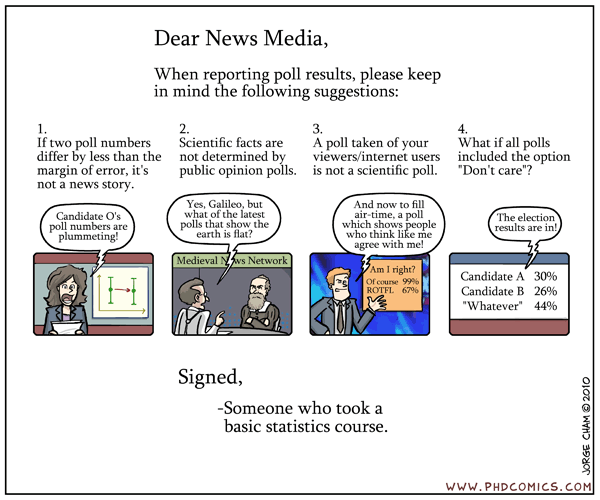

# Pytania wprowadzające

- Co to jest _metoda reprezentacyjna_?

--

- Kto może być objęty badaniem statystycznym?

--

- Jakie badania prowadzone są w Polsce?

--

- Jaki jest cel prowadzenia badań ankietowych?

---

# Metoda reprezentacyjna - definicja

__Metoda reprezentacyjna__ ma na celu określenie zasad dotyczących projektowania, zbierania, przetwarzania oraz analizy danych, które wpływają na koszt i jakość badania.

---

# Podstawowe charakterystyki badania

1. Cel badania
2. __Populacja generalna__ którą badanie ma opisywać
3. Źródła z których może zostać wylosowana próba - __operat losowania__
4. Sposób w jaki próba zostanie wylosowana - __schemat losowania__
5. Sposób zbierania danych

---

# Program Badań Statystyki Publicznej

- Europejskie badanie warunków życia ludności (EU-SILC)
- Czas pracy
- Operaty statystyczne

---

# Próba losowa - uproszczona definicja

Wyniki badania przeprowadzonego na próbie losowej można uogólniać na populację generalną.

---

# Zadanie 

Badanie studentów dotyczące wrażeń z ostatniej sesji.

--

- W jaki sposób stworzyć operat losowania?

--

- W jaki sposób wylosować próbę?

--

- W jaki sposób skontaktować się z wylosowanymi jednostkami i przeprowadzić wywiad?

--

- W jaki sposób zebrać odpowiedzi respondenta?

---

# Podsumowanie

---

class: center, middle, inverse

# Pytania?