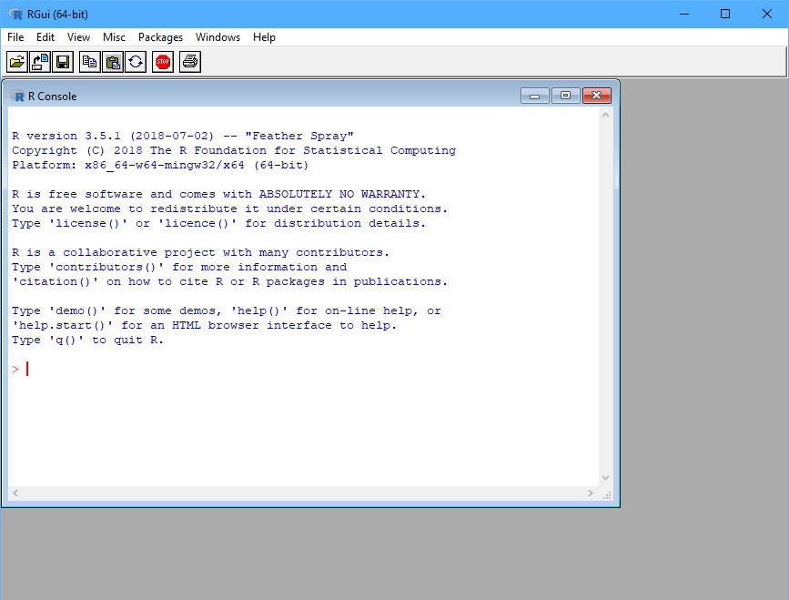
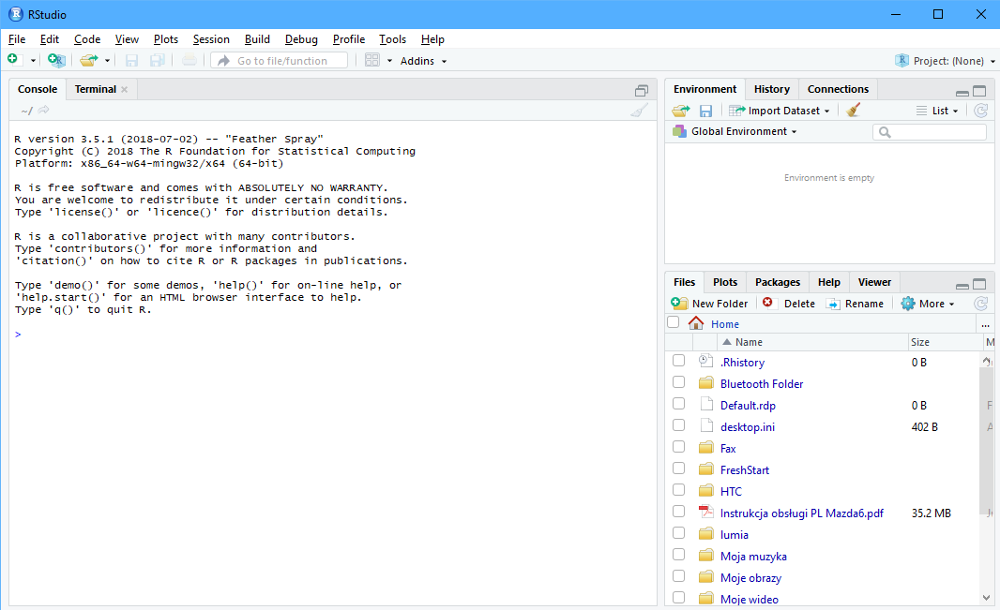
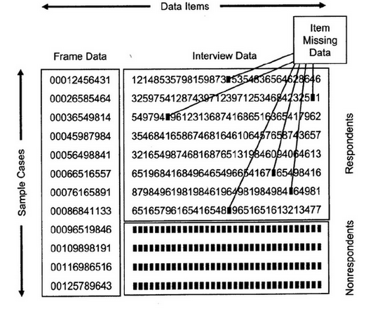

# R to możliwości

Środowisko do obliczeń statystycznych i wizualizacji wyników.

- darmowy

--

- ponad 13 000 rozszerzeń (pakietów) - stan na 15.10.2018

--

- wsparcie społeczności

--

- wszechstronny

--

   - obliczenia i wizualizacje
   - raporty
   - interaktywne dashboardy
   - strony internetowe
   - prezentacje
   - mapy
   - ...

---

# R to język do analizy danych

IEEE Language Rankings 2018

<center></center>

11 - Matlab, 24 - SQL, 32 - Julia, 40 - SAS

[http://blog.revolutionanalytics.com/2018/08/ieee-language-rankings-2018.html](http://blog.revolutionanalytics.com/2018/08/ieee-language-rankings-2018.html)

---

# R to program

Do pobrania ze strony: [R-project](https://www.r-project.org/)

<center></center>

---

# RStudio to wygoda

Do pobrania ze strony: [RStudio](https://www.rstudio.com/)

<center></center>

---

# Projektowanie badania

1. __Losowanie próby na podstawie operatu (populacji)__
2. Wyznaczenie wag z frakcji dla wylosowanych jednostek
3. Zebranie danych od respondentów
4. Korekta post-hoc
5. Szacowanie parametrów

---

# Próba losowa

Próba jest losowa jeśli spełnione są następujące warunki:

--

1. Każda jednostka w populacji generalnej posiada niezerowe prawdopodobieństwo znalezienia się w próbie - $\pi_i$.
2. Prawdopodobieństwo $\pi_i$ jest znane dla każdej jednostki w próbie.
3. Każda para jednostek w populacji generalnej posiada niezerowe prawdopodobieństwo znalezienia się w próbie - $\pi_{ij}$.
4. Prawdopodobieństwo $\pi_{ij}$ jest znane dla każdej pary jednostek w próbie.

---

# Losowanie proste i warstwowe

Losowanie proste

- każda jednostka z populacji generalnej ma jednakowe prawdopodobieństwo znalezienia się w próbie

Losowanie warstwowe

- podzielenie populacji na warstwy i przeprowadzenie losowania prostego w ramach warstw
- zwiększenie reprezentatywności próby
- w praktyce badań statystycznych tworzy się bardzo dużo warstw

---

# Losowanie proste i warstwowe - przykład

Chcemy przeprowadzić badanie statystyczne osób z miasta Poznań i powiatu poznańskiego. Posiadamy informację na temat:

- miejsca zamieszkania - miasto/wieś
- wieku - 12 grup wieku
- płci - kobieta/mężczyzna

---

# Losowanie proste i warstwowe - przykład

Struktura populacji wg wieku jest następująca:

```{r include=FALSE, message=FALSE}
library(tidyverse)
library(survey)
load("dane.RData")
```

```{r echo=FALSE, fig.width=14, fig.height=6}
ggplot(populacja, aes(x=as.factor(wiek))) + 
  geom_bar(aes(y = (..count..)/sum(..count..))) + 
  scale_y_continuous(labels = scales::percent) +
  theme_light() +
  xlab("Wiek") + ylab("Procent") + 
  ggtitle("Populacja 766686 osób")
```

---

# Losowanie proste i warstwowe

.pull-left[
```{r echo=FALSE}
proba <- populacja %>%
  sample_frac(0.0013)

ggplot(proba, aes(x=as.factor(wiek))) + 
  geom_bar(aes(y = (..count..)/sum(..count..))) + 
  scale_y_continuous(labels = scales::percent) +
  theme_light() +
  xlab("Wiek") + ylab("Procent")+ 
  ggtitle("Próba 997 osób")
```

]

.pull-right[

```{r echo=FALSE}
proba <- populacja %>%
  group_by(wiek) %>%
  sample_frac(0.0013)

ggplot(proba, aes(x=as.factor(wiek))) + 
  geom_bar(aes(y = (..count..)/sum(..count..))) + 
  scale_y_continuous(labels = scales::percent) +
  theme_light() +
  xlab("Wiek") + ylab("Procent") + 
  ggtitle("Próba 997 osób")
```


]

---

# Losowanie proste i warstwowe

.pull-left[
```{r echo=FALSE}
proba <- populacja %>%
  sample_frac(0.0003)

ggplot(proba, aes(x=as.factor(wiek))) + 
  geom_bar(aes(y = (..count..)/sum(..count..))) + 
  scale_y_continuous(labels = scales::percent) +
  theme_light() +
  xlab("Wiek") + ylab("Procent") + 
  ggtitle("Próba 230 osób")
```

]

.pull-right[

```{r echo=FALSE}
proba <- populacja %>%
  group_by(wiek) %>%
  sample_frac(0.0003)

ggplot(proba, aes(x=as.factor(wiek))) + 
  geom_bar(aes(y = (..count..)/sum(..count..))) + 
  scale_y_continuous(labels = scales::percent) +
  theme_light() +
  xlab("Wiek") + ylab("Procent") + 
  ggtitle("Próba 230 osób")
```


]


---

# Projektowanie badania

1. Losowanie próby na podstawie operatu (populacji)
2. __Wyznaczenie wag z frakcji dla wylosowanych jednostek__
3. Zebranie danych od respondentów
4. Korekta post-hoc
5. Szacowanie parametrów

---

# Waga z próby 

Losujemy próbę o wielkości 38 000 osób z Polski (populacja 38 milionów). Prawdopodobieństwo wylosowania pojedyńczej jednostki wynosi:

$$\pi_i=38000/38000000=1/1000$$

Każda osoba w próbie reprezentuje 1000 mieszkańców Polski.

W związku z tym waga z próby jest równa:

$$w_i=1/\pi_i=1000$$

--

W losowaniu warstwowym wagi wyznacza się dla każdej warstwy

---

# Pakiet survey

https://cran.r-project.org/web/packages/survey/index.html  
T. Lumley (2017) "survey: analysis of complex survey samples". R package version 3.32.  
T. Lumley (2004) Analysis of complex survey samples. Journal of Statistical Software 9(1): 1-19  

- wyznaczanie wag z frakcji
- deklaracja schematu losowania
- estymacja wartości
- nazwy zmiennych należy poprzedzić tyldą $\sim$

---

# Wyznaczanie wag

Określenie schematu losowania w funkcji `svydesign`.

Wagi wyznaczone ręcznie:

```{r eval=FALSE}
schemat <- svydesign(ids = ~id, strata = ~wiek, weights = ~waga, data=proba)
```

- ids - jednostki losowania pierwszego stopnia (id osoby, id gospodarstwa)
- strata - zmienna warstwująca 
- weights - waga z próby
- data - nazwa zbioru danych

---

# Wyznaczanie wag

Obliczenie wag w funkcji `svydesign` na podstawie liczebności populacji w warstwach:

```{r echo=FALSE}

fpc <- populacja %>%
  group_by(wiek) %>%
  count()

proba <- inner_join(proba, fpc, by="wiek")

```

```{r}
schemat <- svydesign(ids = ~id, strata = ~wiek, fpc = ~n, data=proba)

```

- fpc - liczebność populacji w warstwach

```{r echo=FALSE}
w <- unique(weights(schemat))
names(w) <- unique(proba$wiek)

proba <- proba %>%
  ungroup() %>%
  mutate(waga=weights(schemat))
```

Wagi dla poszczególnych warstw

```{r echo=FALSE}
w
```

---

# Własności wag

Wagi sumują się do liczebności populacji ogółem

```{r}
sum(weights(schemat))
```

---

# Własności wag

Wagi sumują się do liczebności populacji w warstwach

```{r}
table(populacja$wiek)
```

```{r}
suma <- aggregate(waga ~ wiek, proba, sum)
setNames(suma$waga, suma$wiek)
```

---

# Własności wag

Wagi nie sumują się do liczebności populacji w innych przekrojach

```{r}
table(populacja$mw)
```

```{r}
suma <- aggregate(waga ~ mw, proba, sum)
setNames(suma$waga, suma$mw)
```

---

# Projektowanie badania

1. Losowanie próby na podstawie operatu (populacji)
2. Wyznaczenie wag z frakcji dla wylosowanych jednostek
3. __Zebranie danych od respondentów__
4. Korekta post-hoc
5. Szacowanie parametrów

---

# Braki odpowiedzi



# Braki danych

Sposoby radzenia sobie z brakami danych:

- usunięcie obserwacji
- dla _item missing data_ imputacja
- dla _nonrespondents_ kalibracja

---

# Projektowanie badania

1. Losowanie próby na podstawie operatu (populacji)
2. Wyznaczenie wag z frakcji dla wylosowanych jednostek
3. Zebranie danych od respondentów
4. __Korekta post-hoc__
5. Szacowanie parametrów

---

# Imputacja

Bardzo wiele metod:

- zastąpienie wartości zmiennej ilościowej przez średnią lub medianę
- zastąpienie wartości zmiennej jakościowej przez najczęściej występującą
- metoda k-najbliższych sąsiadów
- imputacja regresyjna
- imputacja wielokrotna

---

# Wprowadzenie do kalibracji

- metoda wykorzystywana w estymacji różnych parametrów w badaniach statystycznych z brakami odpowiedzi
- twórcy metody: Carl-Erik Sarndal i Jean Claude Deville
- polski ekspert: dr Marcin Szymkowiak

---

# Kalibracja

Metoda polegająca na skorygowaniu wyjściowych wag celem redukcji obciążenia wynikającego z istnienia braków odpowiedzi. 

Obliczenie skorygowanych wag odbywa się w oparciu o wykorzystanie informacji dodatkowych.

W rezultacie uzyskuje się równowagę rozumianą w ten sposób, że po zastosowaniu kalibracji próba jest _wyglądem_ zbliżona do całej populacji.

---

# Algorytm kalibracji

1. Sprawdź czy wagi w próbie sumują się liczebności populacji, w przekrojach w których jest przeprowadzana estymacja
2. Jeśli nie to wyznacz wartości globalne w tych przekrojach - zmienne pomocnicze w kalibracji
3. Dokonaj korekty wag, w taki sposób, aby suma wag w przekrojach odpowiadała liczebności populacji

---

# Kalibracja w pakiecie survey

Wyznaczanie wartości globalnych dla zmiennych pomocniczych:

```{r}
pop_wiek <- colSums(model.matrix(~wiek,model.frame(~wiek,populacja)))
pop_wiek
```

`(Intercept)` - liczebność populacji. Liczba kategorii $k-1$.

Funkcja `calibrate`:

```{r eval=FALSE}
kalibracja_wiek <- calibrate(design = schemat, formula = ~wiek, 
                             population = pop_plec)
```

---

# Kalibracja w pakiecie survey

Wyznaczanie wartości globalnych dla zmiennych pomocniczych:

```{r}
pop <- colSums(model.matrix(~plec*mw,model.frame(~plec*mw,populacja)))
pop
```

Użycie w formule `*` wyznacza wartości globalne dla kilku zmiennych pomocniczych.

Funkcja `calibrate`:

```{r eval=FALSE}
kalibracja_plec_mw <- calibrate(design = schemat, formula = ~plec*mw, 
                                population = pop)
```


---

# Zastosowanie kalibracji

- kalibracja zapewnia zgodność sumy wag w przekrojach, w których została zastosowana
- z wykorzystaniem kalibracji można ograniczyć wpływ braków danych w próbie
- można także zapewnić zgodność struktury w przekrojach, które nie zostały uwzględnione na etapie losowania próby

---

# Kalibracja

- Zakładamy, że populacja $U=\left\{1,2,\ldots,N\right\}$  składa się z $N$ elementów.
- Z populacji tej losujemy zgodnie z określonym schematem losowania próbę $s\subseteq U$, składającą się z $n$ elementów.
- Niech $\pi_{i}$ oznacza prawdopodobieństwo inkluzji pierwszego rzędu tj. $\pi_{i}=P\left(i\in s\right)$ a $w_{i}=1/\pi_{i}$ wagę przypisaną $i$-tej jednostce w procesie losowania.
- Zakładamy, że głównym celem jest oszacowanie wartości globalnej zmiennej $y$: 
$$Y=\sum_{i=1}^{N}y_{i},$$
gdzie $y_{i}$ oznacza wartość zmiennej $y$ dla $i$-tej jednostki, $i=1,\ldots,N$.

---

# Kalibracja

- Niech ponadto $x_{1},\ldots,x_{k}$ oznaczają zmienne pomocnicze, a $\mathbf{X}_{j}$ oznacza wartość globalną zmiennej $x_{j}$, $j=1,\ldots,k$, tj.
$$\mathbf{X}_{j}=\sum_{i=1}^{N}x_{ij},$$
gdzie $x_{ij}$ oznacza wartość $j$ - tej zmiennej pomocniczej dla $i$ - tej jednostki badania.
- Do oszacowania wartości globalnej zmiennej $y$ wykorzystujemy estymator Horvitza-Thompsona:

$$\hat{Y}_{HT}=\sum_{i=1}^{n}w_{i}y_{i}$$

---

# Kalibracja

- W praktyce bardzo często zdarza się, że:

$$\sum_{s}w_{i}x_{ij} \neq \mathbf{X}_{j}$$
co oznacza konieczność rozważenia zastosowania kalibracji.

---

# Kalibracja

- Zatem niech $\mathbf{w}=\left(w_{1},\ldots,w_{n}\right)^{T}$ będzie wektorem wag wynikających ze schematu losowania próby, a $\mathbf{d}=\left(d_{1},\ldots,d_{n}\right)^{T}$ poszukiwanym wektorem wag kalibracyjnych, gdzie $n$ oznacza liczebność próby.
- Niech $G$ będzie dowolną funkcją spełniającą następujące warunki:
  - $G\left(\cdot\right)$ jest dwukrotnie różniczkowalna,
  - $G\left(\cdot\right)\geq 0$,
  - $G\left(1\right)=0$,
  - $G'\left(1\right)=0$,
  - $G''\left(1\right)=1$.
- Nowo wyznaczone wagi powinny nieznacznie się różnić od wag $d_{i}$ oraz powinny spełniać warunek:
$$\sum_{s}d_{i}x_{ij} = \mathbf{X}_{j}$$

---

# Wyznaczanie wag kalibracyjnych

- Minimalizacja funkcji odległości: 
$$D\left(\mathbf{d},\mathbf{w}\right)=\sum_{i=1}^{n}w_{i}G\left(\frac{d_{i}}{w_{i}}\right)\longrightarrow \textrm{min}$$
- Równania kalibracyjne: 
$$\sum_{i=1}^{n}d_{i}x_{ij}=\mathbf{X}_{j},\quad j=1,\ldots,k,$$
- Warunki ograniczające:
$$L\leq \frac{d_{i}}{w_{i}}\leq U, \quad \text{gdzie: } L<1\  \text{i}\  U>1,\  i=1,\ldots,n.$$

---

# Funkcja G

W praktycznych zastosowaniach najczęściej wykorzystuje się funkcję $G$ wpostaci $G_{1}\left(x\right)=\frac{1}{2}\left(x-1\right)^{2}$. w tym przypadku mamy bowiem:

$$D\left(\mathbf{w},\mathbf{d}\right)=\sum_{i=1}^{n}d_{i}G\left(\frac{w_{i}}{d_{i}}\right)=\sum_{i=1}^{n}d_{i}\frac{1}{2}\left(\frac{w_{i}}{d_{i}}-1\right)^{2}=\frac{1}{2}\sum_{i=1}^{n}\frac{\left(w_{i}-d_{i}\right)^{2}}{d_{i}}.$$

W literaturze wskazuje się wiele różnych postaci tej funkcji.

---

# Wagi kalibracyjne

Wektor wag kalibracyjnych $\mathbf{d}=\left(d_{1},d_{2},\ldots,d_{n}\right)^{T}$ jest rozwiązaniem zadania minimalizacji:
$$\mathbf{d}=\textrm{argmin}_{v}D\left(\textbf{v},\textbf{w}\right),$$
$$\mathbf{X}=\tilde{\textbf{X}},$$
przy czym
$$D\left(\mathbf{v},\textbf{w}\right)=\frac{1}{2}\sum_{i=1}^n\frac{\left(v_{i}-w_{i}\right)^{2}}{w_{i}}$$
$$\tilde{\mathbf{X}}=\left(\sum_{i=1}^n{d_{i}x_{i1}},\sum_{i=1}^n{d_{i}x_{i2}},\ldots,\sum_{i=1}^n{d_{i}x_{ik}}\right)^{T},\quad \mathbf{X}=\left(\sum_{i=1}^N{x_{i1}},\sum_{i=1}^N{x_{i2}},\ldots,\sum_{i=1}^N{x_{ik}}\right)^{T}.$$

---

# Wagi kalibracyjne

Rozwiązaniem zadania minimalizacji jest wektor wag kalibracyjnych $\mathbf{d}=\left(d_{1},d_{2},\ldots,d_{n}\right)^{T}$, którego składowe spełniają równanie
$$d_{i}=w_{i}+w_{i}\left(\textbf{X}-\hat{\textbf{X}}\right)^{T}\left(\sum_{i=1}^n{w_{i}\underline{\textbf{x}}_{i}\underline{\textbf{x}}_{i}^{T}}\right)^{-1}\underline{\textbf{x}}_{i}$$
przy czym:
$$\hat{\textbf{X}}=\left(\sum_{i=1}^n{w_{i}x_{i1}},\sum_{i=1}^n{w_{i}x_{i2}},\ldots,\sum_{i=1}^n{w_{i}x_{ik}}\right)^{T},$$
$$\underline{\textbf{x}}_{i}=\left(x_{i1},x_{i2},\ldots,x_{ik}\right)^{T}.$$

---

# Projektowanie badania

1. Losowanie próby na podstawie operatu (populacji)
2. Wyznaczenie wag z frakcji dla wylosowanych jednostek
3. Zebranie danych od respondentów
4. Korekta post-hoc
5. __Szacowanie parametrów__

---

# Szacowanie parametrów

Obliczanie wartości globalnej, średniej bądź wskaźnika w populacji na podstawie próby.

Dzięki zastosowaniu odpowiednich formuł możemy zmierzyć błąd wynikający z wykorzystania próby zamiast zbadania całej populacji.

---

# Estymator Horvitza-Thompsona

Estymator wartości globalnej 

$$\hat{y}^{HT}=\sum\limits_{i=1}^{n}{x_iw_i}$$

Estymator wartości średniej

$$\hat{\bar{y}}^{HT}=\frac{1}{n}\sum\limits_{i=1}^{n}{x_iw_i}$$

gdzie:

- $n$ - liczebność próby,
- $x_i$ - wartość cechy dla $i$-tej jednostki,
- $w_i$ - wartość wagi dla $i$-tej jednostki.

---

# Wariancja estymatora Horvitza-Thompsona

Estymator wartości globalnej 

$$V(\hat{y}^{HT})=\frac{N-n}{N}\cdot N^2 \cdot \frac{s_x}{n}$$

Estymator wartości średniej

$$V(\hat{\bar{y}}^{HT})=\frac{N-n}{N} \cdot \frac{s_x}{n}$$

gdzie: 

- $N$ - liczebność populacji,
- $n$ - liczebność próby,
- $s_x$ - wariancja cechy $x$.

---

# Finite Population Correction

Różnica pomiędzy losowaniem ze zwracaniem, a losowaniem bez zwracania

$$\text{FPC}=\frac{N-n}{N}$$

???

https://www.statisticshowto.datasciencecentral.com/finite-population-correction-factor/

---

# Błąd standardowy oszacowania

Interpretowalną miarą błędu jest błąd standardowy:

$$\text{SE}=\sqrt{V(\hat{y^{HT}})}$$

--

Względny błąd oszacowania:

$$\text{CV}=\frac{\text{SE}}{\hat{y^{HT}}}$$

Podawany w procentach i wg standardów GUS nie powinien przekraczać 10%.

---

# Zależności

- większa próba = większe koszty
- większa próba = mniejszy błąd oszacowania

---

# Estymacja wskaźnika

Ogółem:

```{r eval=FALSE}
svyratio(numerator = ~licznik, denominator = ~mianownik, 
         design = schemat)
```


- licznik i mianownik musi być zdefiniowany jako zmienna binarna.

--

W przekrojach:

```{r eval=FALSE}
svyby(formula = ~licznik, denominator = ~mianownik, 
      by = ~przekroj, design = schemat, FUN = svyratio)

```


---

# Przedział ufności

W jakim przedziale i z jakim prawdopodobieństwem znajduje się wartość prawdziwa:

$$\left(\hat{y}^{HT}- z_{1-\alpha/2}\cdot\sqrt{V(\hat{y}^{HT})} \leq \hat{y}^{HT} \leq \hat{y}^{HT}+ z_{1-\alpha/2}\cdot\sqrt{V(\hat{y}^{HT})}\right)$$

- 90% przedział ufności - $z_\alpha = 1,64$, dla $\alpha=0,10$
- 95% przedział ufności - $z_\alpha = 1,96$, dla $\alpha=0,05$
- 99% przedział ufności - $z_\alpha = 2,58$, dla $\alpha=0,01$

Obliczanie kwantyla rozkładu w R:

```{r}
qnorm(1-0.05/2)
```


---

class: center, middle, inverse

# Pytania?