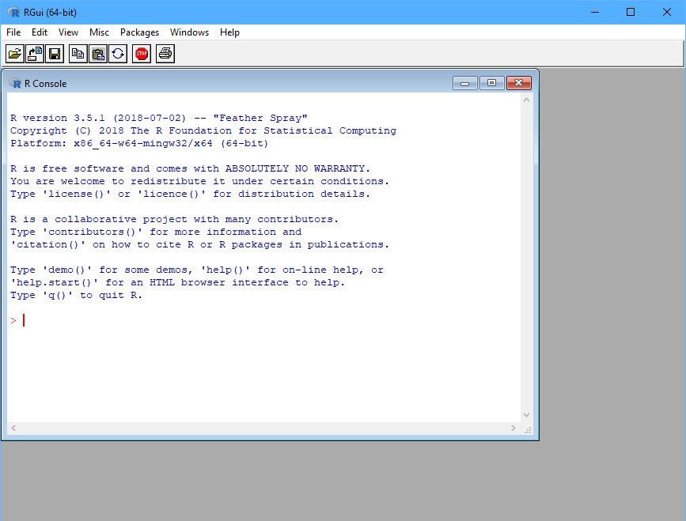

class: inverse, center, middle

# Why R?

---

# R to możliwości

Środowisko do obliczeń statystycznych i wizualizacji wyników.

- darmowy

--

- ponad 13 000 rozszerzeń (pakietów) - stan na 15.10.2018

--

- wsparcie społeczności

--

- wszechstronny

--

   - obliczenia i wizualizacje
   - raporty
   - interaktywne dashboardy
   - strony internetowe
   - prezentacje
   - mapy
   - ...

---

# R to język do analizy danych

IEEE Language Rankings 2018

11 - Matlab, 24 - SQL, 32 - Julia, 40 - SAS

[http://blog.revolutionanalytics.com/2018/08/ieee-language-rankings-2018.html](http://blog.revolutionanalytics.com/2018/08/ieee-language-rankings-2018.html)

---

# R to program

Do pobrania ze strony: [R-project](https://www.r-project.org/)

---

# RStudio to wygoda

Do pobrania ze strony: [RStudio](https://www.rstudio.com/)

---

# R jako kalkulator

Oblicz wartość wyrażeń:

1. $\frac{2^3\cdot6^2}{(\frac{1}{2})^2\cdot(\frac{4}{5})^3}$
2. $\sqrt[3]{6-3.5+2^{11}}$
3. $\pi+\sqrt{e^4}$
4. $5! - log_{10}100$
5. $|1-e|$

---

# Próba losowa

Próba jest losowa jeśli spełnione są następujące warunki:

1. Każda jednostka w populacji generalnej posiada niezerowe prawdopodobieństwo znalezienia się w próbie - $\pi_i$.
2. Prawdopodobieństwo $\pi_i$ jest znane dla każdej jednostki w próbie.
3. Każda para jednostek w populacji generalnej posiada niezerowe prawdopodobieństwo znalezienia się w próbie - $\pi_{ij}$.
4. Prawdopodobieństwo $\pi_{ij}$ jest znane dla każdej pary jednostek w próbie.

---

# Waga z próby

Losujemy próbę o wielkości 38 000 osób z Polski (populacja 38 milionów). Prawdopodobieństwo wylosowania pojedyńczej jednostki wynosi:

$$\pi_i=38000/38000000=1/1000$$

Każda osoba w próbie reprezentuje 1000 mieszkańców Polski.

W związku z tym waga z próby jest równa:

$$w_i=1/\pi_i=1000$$

---

# Zadanie

Wylosuj próbę losową stanowiącą 2% populacji uwzględniając w losowaniu warstwowym miejsce zamieszkania (_mw_) i wiek (_wiek_).

---

class: center, middle, inverse

# Pytania?