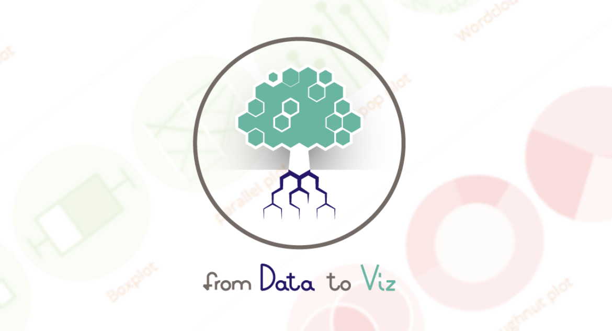

# RMarkdown

Połączenie języka __R__ i __markdown__ umożliwia tworzenie dynamicznych raportów, które można eksportować do plików:

- html,
- pdf (potrzebny [MiKTeX](https://miktex.org/)),
- docx.

---

# Markdown - tekst

Większość raportu będzie stanowił zwykły tekst.

.pull-left[
__Kod__
```
To jest zwykły tekst.
_Kursywa_ i __pogrubienie__.
Enter nie wystarczy, żeby przejść  
do nowej linii - trzeba wstawić  
co najmniej __dwie spacje__.
```
]
.pull-right[
__Wynik__   
  
To jest zwykły tekst.  
_Kursywa_ i __pogrubienie__.  
Enter nie wystarczy, żeby przejść  
do nowej linii - trzeba wstawić  
co najmniej __dwie spacje__.
]

---

# Nagłówki

Struktura dokumentu definiowa jest przez nagłówki.

__Kod__
```
# Nagłówek pierwszego stopnia
## Nagłówek drugiego stopnia
### Nagłówek trzeciego stopnia
```

__Wynik__   
   
# Nagłówek pierwszego stopnia
## Nagłówek drugiego stopnia
### Nagłówek trzeciego stopnia

---
# Listy

.pull-left[
__Kod__
```
1. Pozycja 1
2. Pozycja 2
3. Pozycja 3
    - Pozycja 3a
    - Pozycja 3b
```
]
.pull-right[
__Wynik__   
   
1. Pozycja 1
2. Pozycja 2
3. Pozycja 3
    - Pozycja 3a
    - Pozycja 3b

]

---

# Linki

Adresy stron internetowych automatycznie zamieniają się na linki. Można też stworzyć tekst, który będzie prowadził do strony.

__Kod__
```
http://ue.poznan.pl/pl/

[Uniwersytet Ekonomiczny w Poznaniu](http://ue.poznan.pl/pl/)
```

__Wynik__   
   
http://ue.poznan.pl/pl/

[Uniwersytet Ekonomiczny w Poznaniu](http://ue.poznan.pl/pl/)

---

# Wizualizacja danych statystycznych

<center></center>

https://www.data-to-viz.com/

---

# Pakiet ggplot2

```{r include=FALSE}
library(tidyverse)
load("gss.RData")
```


```{r, fig.width=14, fig.height=6}
ggplot(gss, aes(x=race)) # stworzenie siatki
```

---

# Pakiet ggplot2

```{r, fig.width=14, fig.height=6}
ggplot(gss, aes(x=race)) + # stworzenie siatki
  geom_bar() # określenie sposobu wizualizacji
```


---

class: center, middle, inverse

# Pytania?