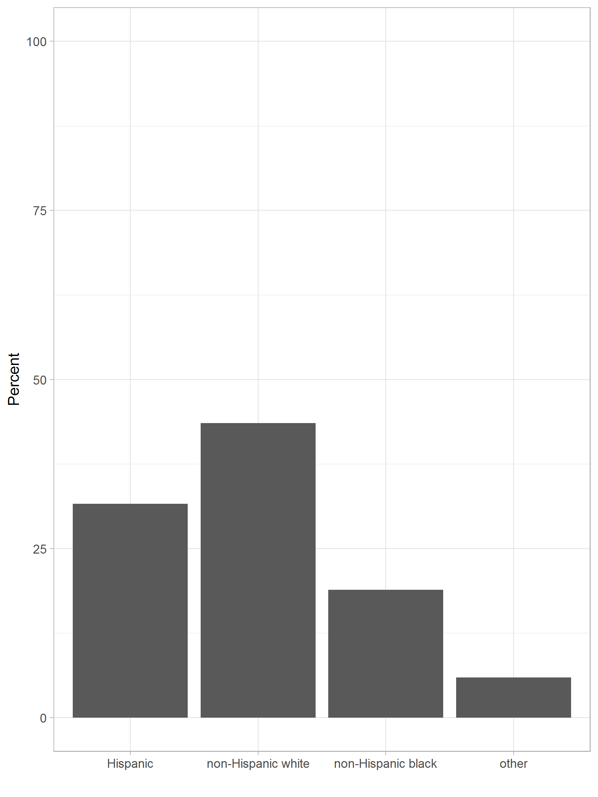
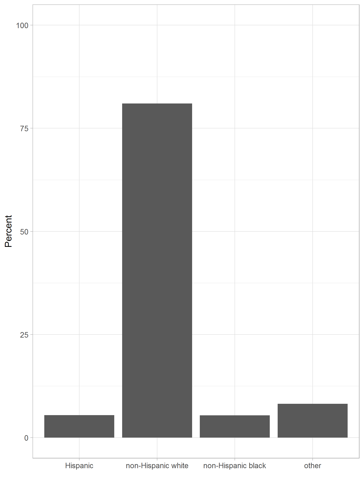

# Estymator Horvitza-Thompsona

Estymator wartości globalnej 

$$\hat{y}^{HT}=\sum\limits_{i=1}^{n}{x_iw_i}$$

Estymator wartości średniej

$$\hat{\bar{y}}^{HT}=\frac{1}{n}\sum\limits_{i=1}^{n}{x_iw_i}$$

gdzie:

- $n$ - liczebność próby,
- $x_i$ - wartość cechy dla $i$-tej jednostki,
- $w_i$ - wartość wagi dla $i$-tej jednostki.

---

# Wariancja estymatora Horvitza-Thompsona

Estymator wartości globalnej 

$$V(\hat{y}^{HT})=\frac{N-n}{N}\cdot N^2 \cdot \frac{s_x}{n}$$

Estymator wartości średniej

$$V(\hat{\bar{y}}^{HT})=\frac{N-n}{N} \cdot \frac{s_x}{n}$$

gdzie: 

- $N$ - liczebność populacji,
- $n$ - liczebność próby,
- $s_x$ - wariancja cechy $x$.

---

# Finite Population Correction

Różnica pomiędzy losowaniem ze zwracaniem, a losowaniem bez zwracania

$$\text{FPC}=\frac{N-n}{N}$$

???

https://www.statisticshowto.datasciencecentral.com/finite-population-correction-factor/

---

# Błąd standardowy oszacowania

Interpretowalną miarą błędu jest błąd standardowy:

$$\text{SE}=\sqrt{V(\hat{y^{HT}})}$$

--

Względny błąd oszacowania:

$$\text{CV}=\frac{\text{SE}}{\hat{y^{HT}}}$$

Podawany w procentach i wg standardów GUS nie powinien przekraczać 10%.

---

# Zależności

- większa próba = większe koszty
- większa próba = mniejszy błąd oszacowania

---

# Zbiór danych

National Health and Nutrition Examination Survey (NHANES)

https://www.cdc.gov/nchs/nhanes/index.htm

- Ocena zdrowia dzieci i dorosłych w USA
- operat jest warstwowany cechami geograficznymi i ludnością
- 4-stopniowy schemat losowania:
  - 1 stopień: losowanie hrabstw w ramach warstw
  - 2 stopień: losowanie miast w ramach hrabstw
  - 3 stopień: losowanie gospodarstw w ramach miast
  - 4 stopień: losowanie osób w ramach gospodarstw

---

# Pakiet survey

- deklaracja schematu losowania
- estymacja wartości
- nazwy zmiennych należy poprzedzić tyldą $\sim$

---

# Wyniki nieprzeważone i przeważone

.pull-left[

]

--

.pull-right[

]

---

class: center, middle, inverse

# Pytania?