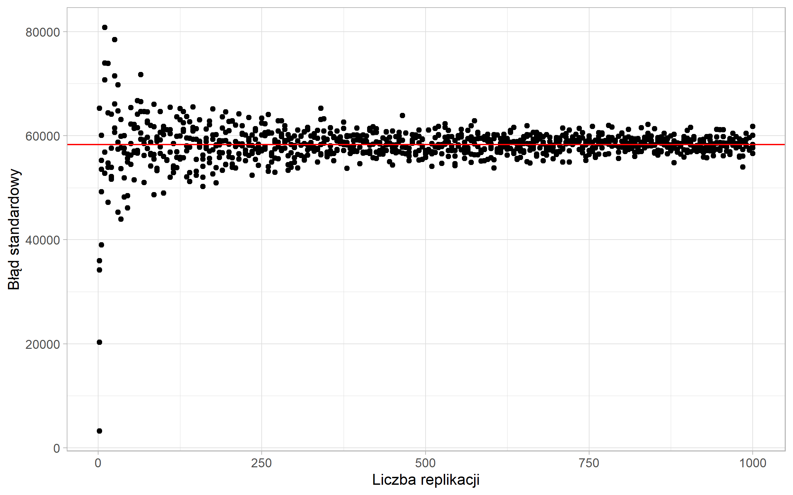

```{r include=FALSE}
library(tidyverse)
library(countdown)
options(scipen=100)
```

# Problem

- wzór na oszacowanie błędu standardowego jest inny dla każdego schematu losowania

- czasami trudno znaleźć analityczny wzór na ten błąd

---

# Bootstrap

> To pull oneself up by one's bootstraps

- wielokrotne losowanie próby według schematu losowania

- metoda zaproponowana przez Efrona (1979)

---

# Algorytm bootstrap

1. Wylosuj $B$ podprób o rozmiarze $n-1$ według schematu losowania

2. Oszacuj badaną cechę na podstawie wylosowanej podpróby - $\hat{y}^{b}$

3. Oblicz wariancję estymatora jako:

$$V^b(\hat{y})=\frac{1}{B-1}\sum\limits_{b=1}^{B}(\hat{y}^{b}-\hat{y})^2$$

---

## Zbieżność oszacowań wariancji



---

# Bootstrap w pakiecie survey

Zamiana obiektu ze schematem losowania na próby bootstrapowe:

```{r eval=FALSE}
as.svrepdesign(design = schemat, 
               type = "bootstrap", 
               replicates = 500)
```


- `design` - schemat losowania określony za pomocą funkcji `svydesign()`

- `type` - wybór metody

- `replicates` - liczba losowanych podprób

---

class: inverse

# Zadanie

Dla zbioru _apiclus1_ oszacuj metodą bootstrap błąd standardowy oszacowania średniej wartości zmiennej `api99`. Wylosuj 500 podprób i sprawdź jaka jest różnica pomiędzy wynikiem otrzymanym z wykorzystaniem metody bootstrap oraz sposobem analitycznym.

`r countdown(minutes = 10, seconds = 0, top = 0)`

---

class: center, middle, inverse

# Pytania?

