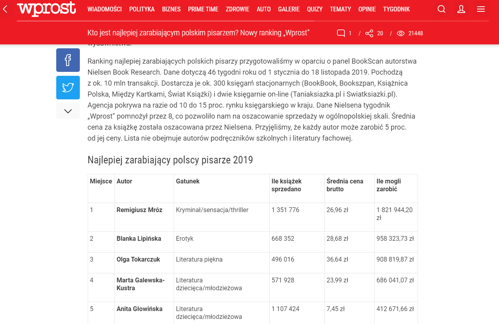

```{r include=FALSE}
library(tidyverse)
library(countdown)
options(scipen=100)
```

# Metoda reprezentacyjna

- Booth, C., (1889-1903), [Life and Labour of the People of London](https://booth.lse.ac.uk/) 

- Thurstone, L. i Chave, E., (1929), The Measurement of Attitude, Chicago: University of Chicago.

- Likert, R., (1932), A technique for the measurement of attitudes, Archives of psychology, 140, pp. 5-53.

- Hansen, M., (1939), Survey of Unemployment.

- Deming, W., (1950), Some Theory of Sampling, New York: Dover.

- Hansen, M., Hurwitz, W. i Madow, W., (1953), Sample survey methods and theory, Wiley.

---

### !@#$%^&



[źródło](https://www.wprost.pl/tygodnik/10274294/kto-jest-najlepiej-zarabiajacym-polskim-pisarzem-nowy-ranking-wprost.html)

---

# Błąd pomiaru

Measurement error - różnica pomiędzy tym, co chcemy zmierzyć, a tym co otrzymujemy od respondenta.

- Have you ever, even once, used any form of cocaine? (National Survey on Drug Use and Health)

--

Response bias (efekt respondenta) - wpływ respondenta na otrzymywane wyniki. 

---

# Błąd przetwarzania

Processing error - błąd wynikający z zebrania odpowiedzi bez szerszego kontekstu. Także błąd kodowania pytań otwartych.

- Ile razy dziennie doświadczasz agresji ze strony innych ludzi? (National Crime Victimization Survey)

--

- Czy w ciągu ostatnich miesięcy słyszałeś o jakichkolwiek zmianach w nastrojach rynkowych? (Surveys of Consumers)

---

# Błąd pokrycia


---

# Błąd pokrycia

Coverage error - objęcie badaniem niekompletnej zbiorowości. 

Coverage bias -  różnica pomiędzy wynikami dla jednostek objętych i nieobjętych badaniem.

--

Ankiety telefoniczne przykładem występowania błędu pokrycia.

---

# Sampling error

Sampling bias - jednostki w operacie losowania nie mają szans na dostanie się do próby

Sampling variance - wielokrotne losowanie próby daje różne wyniki

---

# Nonresponse error

Uczniowie nieobecni podczas testu kompetencji z matematyki mogą celowo opuszczać ten dzień w szkole ze względu na świadomość mniejszych umiejętności. 

Uzyskany przez szkołę wynik będzie z tego względu wyższy niż w przypadku obecności wszystkich uczniów.

---

# Adjustement error

Wykorzystanie danych na temat populacji, wskaźnika kompletności w poprawie jakości próby może spowodować przeszacowanie lub niedoszacowanie wyników dla określonych grup.

---

class: center, middle

# TOTAL SURVEY ERROR

---

### Błąd przeżywalności (survivor bias)

Opieranie się wyłącznie na dostępnych danych bez głębszej analizy przyczyn.

- hełmy żołnierzy - wprowadzenie nowego kształtu hełmu podczas I WŚ i nagły wzrost liczby żołnierzy w szpitalach

- opancerzenie bombowców - wzmacnianie uszkodzonych elementów samolotów podczas II WŚ

- większa przeżywalność zwierząt po upadku z wysokich pięter niż z niskich 

- zakładanie firmy, bo wszystkim, którzy to zrobili się udało

- wynalezienie leku na białaczkę zwiększyło liczbę chorych

- palacze umierają rzadziej

---

# Paradoks Simpsona

Efekt działania kilku grup wydaje się odwrócony, kiedy grupy są połączone.


---

### Nabór na Uniwersytecie w Berkley

Spośród kandydatów przyjęto 45% mężczyzn i 30% kobiet.

Uniwersytet został oskarżony o seksizm i sprawa została skierowana do sądu.

---

class: inverse

# Zadanie

Na podstawie zbioru danych [berkley](data/berkley.RData) oblicz odsetek przyjętych kobiet i mężczyzn. Proponuję wykorzystać przetwarzanie potokowe i funkcje `group_by`, `summarise` i `mutate`.

`r countdown(minutes = 10, seconds = 0, top = 0)`

---

class: center, middle, inverse

# Pytania?

