```{r include=FALSE}
library(countdown)
```


# Język R

Interpretowany język programowania oraz środowisko do obliczeń statystycznych i wizualizacji wyników [[Wikipedia 2020]](https://pl.wikipedia.org/wiki/R_(j%C4%99zyk_programowania)).

.pull-left[
Zalety:

- darmowy
- wieloplatformowy
- wsparcie społeczności
- wykorzystywany przez naukowców
- 16428 pakietów (16.10.2020)
- własne czasopismo [R Journal](https://journal.r-project.org/)

]

.pull-right[
Wady:

- niska jakość niektórych pakietów
- trzeba korzystać z wielu pakietów
- czasami coś nie działa
- przetwarzanie w pamięci

]

---

<iframe src="https://embed.polleverywhere.com/multiple_choice_polls/mTrZbxcbS8BUiT2qg1zzT?controls=none&short_poll=true" width="100%" height="100%" frameBorder="0"></iframe>

---

# Możliwości R

- obliczenia i wizualizacje

- [raporty](https://rmarkdown.rstudio.com/gallery.html)

- [interaktywne dashboardy](https://shiny.rstudio.com/gallery/)

- strony internetowe

- [książki](https://r4ds.had.co.nz/)

- prezentacje

- [zaliczenia i egzaminy](http://www.r-exams.org/)

- [mapy](https://raw.githubusercontent.com/lwawrowski/geomarketing/master/mapa_wybory.png)

- ...

---

# Źródła wiedzy i pomocy

- [Podstawy programowania w R (pl)](http://www.wawrowski.edu.pl/ppr/)

- [Wprowadzenie do R z żyrafami (en)](https://tinystats.github.io/teacups-giraffes-and-statistics/index.html)

- [R Bootcamp - wizualizacja i przetwarzanie (en)](https://r-bootcamp.netlify.com/)

- [Elementarz programisty (pl)](https://nowosad.github.io/elp/)

- [R for Data Science (en)](http://r4ds.had.co.nz/) - kompendium R po angielsku 

- [Język R (pl)](https://helion.pl/ksiazki/jezyk-r-kompletny-zestaw-narzedzi-dla-analitykow-danych-hadley-wickham-garrett-grolemund,jezrko.htm) - polskie tłumaczenie, wydanie papierowe

- [Programowanie w języku R. Analiza danych, obliczenia, symulacje. (pl)](http://www.gagolewski.com/publications/programowanier/) - wydanie papierowe nastawione na programowanie

- [Ściągawki (en)](https://www.rstudio.com/resources/cheatsheets/) - atrakcyjny wizualnie krótki opis funkcji w formacie A4

- [CRAN Task View (en)](https://cran.r-project.org/web/views/) - zestawy pakietów przyporządkowane do tematów

- [METACRAN (en)](https://www.r-pkg.org/) - wygodna wyszukiwarka pakietów

---

# Instalacja R

Online:

1. RStudio Cloud [rstudio.cloud](https://rstudio.cloud/)

Desktop:

1. R [(r-project.org)](https://www.r-project.org/) -> CRAN -> 0-Cloud -> Download R for Windows -> base

2. RStudio Desktop [(rstudio.com)](https://www.rstudio.com/products/rstudio/download/)

---

class: center, middle, inverse

# Interfejs R

---

# R

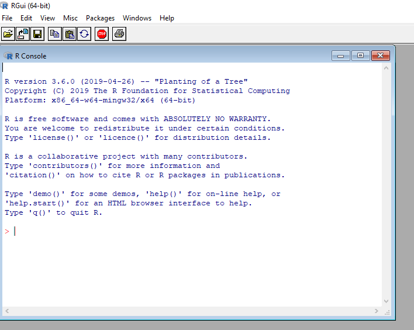

---

# RStudio

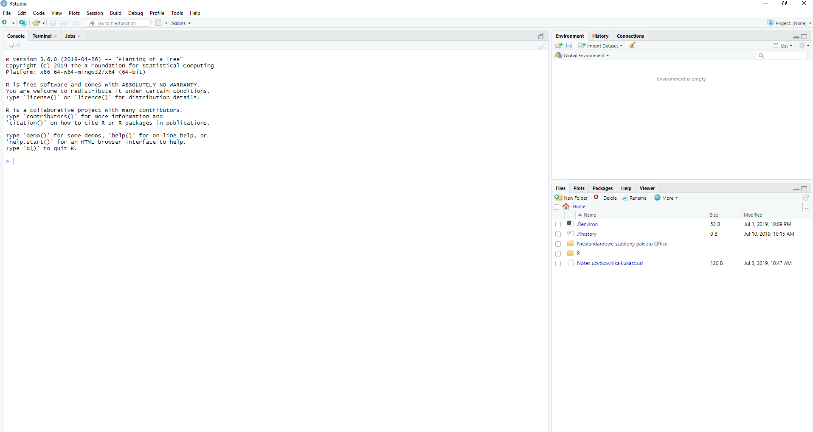

---

# R vs RStudio

.pull-left[
Zalety R

- mniej zasobożerny

- szybsze przetwarzanie 

- świetny do trybu wsadowego

]

.pull-right[
Zalety RStudio

- zarządzanie projektami

- podgląd obiektów w pamięci

- kolorowanie i podpowiadanie składni

- praca na wielu plików w różnych formatach

- tryb debugowania

- integracja z git

]

---

# Projekt

.pull-left[

- katalog roboczy (working directory)

- domyślnie _user/documents_

- funkcja `getwd()`

- w ramach katalogu roboczego nie trzeba wskazywać pełnej ścieżki do pliku

- projekt w R jest katalogiem, który zawiera plik .Rproj

- tworzenie poprzez _File -> New Project_, menu w prawym górnym rogu lub ikonę poniżej menu _Edit_

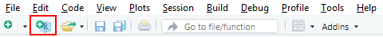

]

.pull-right[

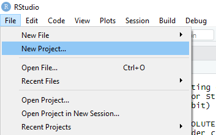

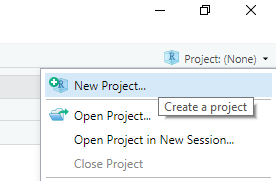

]

---

# Projekt

.pull-left[

- _New Directory_ - tworzy nowy katalog we wskazanym miejscu i powiązuje go z RStudio

- _Existing Directory_ - powiązuje istniejący już na dysku katalog z RStudio

- _Version Control_ - tworzy nowy katalog we wskazanym miejscu na podstawie repozytorium

]

.pull-right[

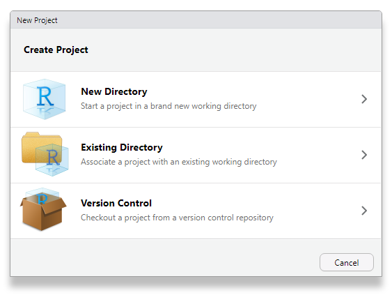

]

---

# Projekt - _New Directory_

.pull-left[

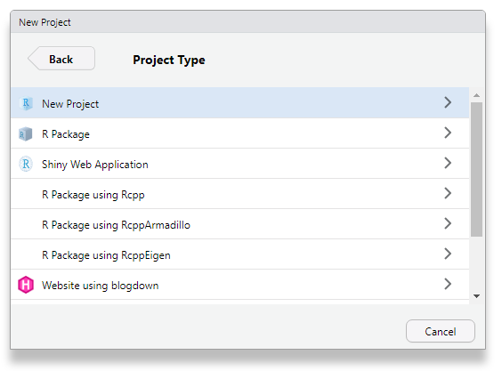

]

.pull-right[

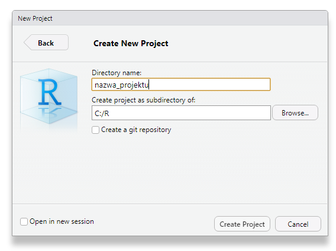

- na tym etapie możemy utworzyć repozytorium git
- _Open in new session_ powoduje utworzenie projektu w nowej instancji programu

]

--- 

# Projekt - _Existing Directory_

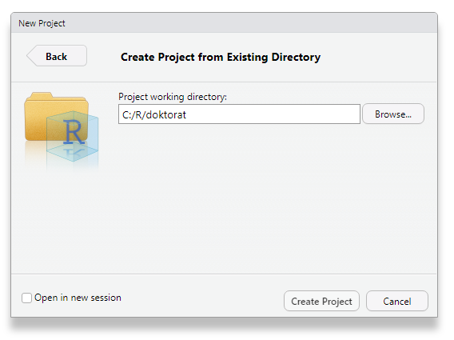


---

## Interfejs - pasek narzędzi / nowy plik

.pull-left[

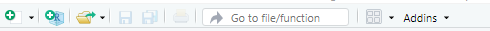

- nowy plik

- nowy projekt

- otwórz plik

- zapisz plik 

- zapisz wszystko

- drukuj

- idź do...

- widok 

- dodatki

]

.pull-right[

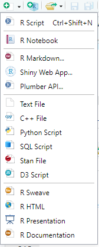

]

---

# Interfejs

<center>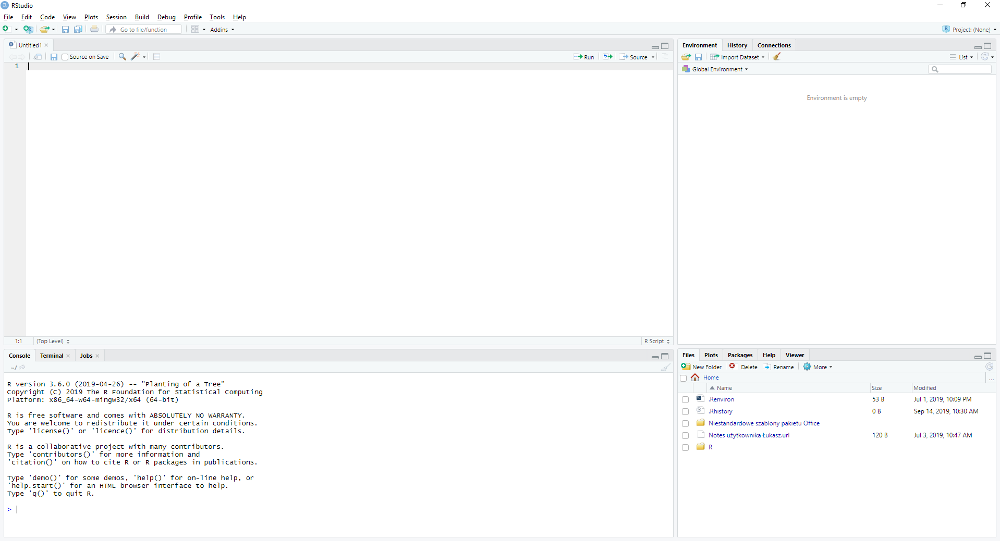</center>

---

# Intefejs - Console

.pull-left[

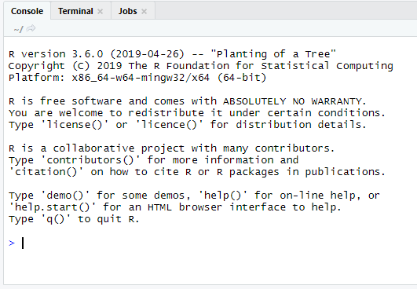

]

.pull-right[

- można wpisywać funkcje do wykonania

- tutaj pojawiają się wszystkie wyniki tekstowe

]

---

# Intefejs - Terminal

.pull-left[

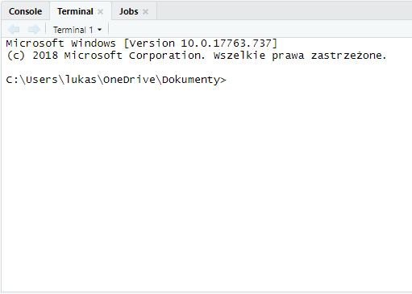

]

.pull-right[

- dostęp do konsoli Windows (cmd)

]

---

# Intefejs - Jobs

.pull-left[

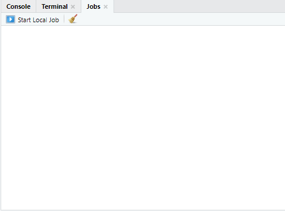

]

.pull-right[

- uruchamianie skryptów R niezależnie od IDE

- stosunkowo nowa funkcja

]

---

# Interfejs - Environment

.pull-left[

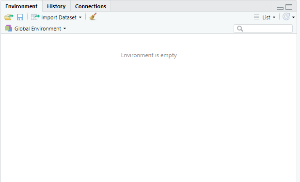

]

.pull-right[

- podgląd wszystkich obiektów z pamięci

- zbiory danych, liczby, funkcje

- możliwość załadowania lub zapisania zawartości pamięci 

- import zbiorów danych

- czyszczenie zawartości pamięci

- widok listy lub siatki

]

---

# Interfejs - History

.pull-left[

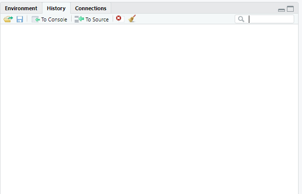

]

.pull-right[

- lista wszystkich uruchomionych funkcji
]

---

# Interfejs - Connections

.pull-left[

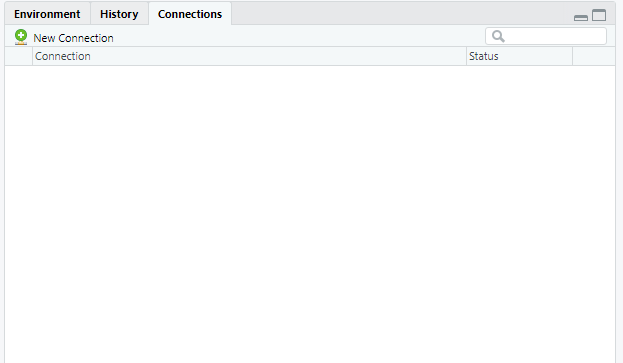

]

.pull-right[

- połączenia z bazami danych
]

---

# Interfejs - Files

.pull-left[

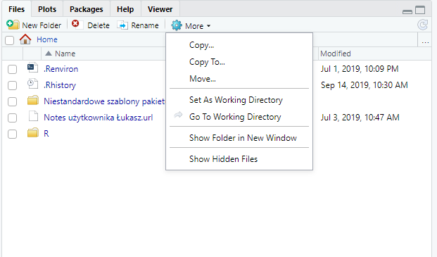

]

.pull-right[

- lista plików i katalogów w katalogu roboczym

- możliwe wykonywanie operacji na plikach, ale wygodniej to zrobić w Eksploratorze plików Windowsa, bo w RStudio nie działa metoda "przeciągnij i upuść"

]

---

# Interfejs - Plots

.pull-left[

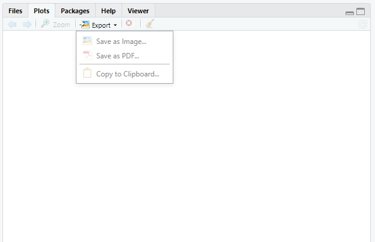

]

.pull-right[

- miejsce na wykresy statyczne

- można eksportować do pliku graficznego lub PDF

- zawartość może być przeniesiona do schowka

- przechowuje wszystkie wykresy od początku sesji R

]

---

# Interfejs - Packages

.pull-left[

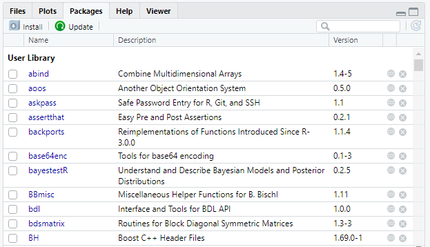

]

.pull-right[

- instalacja i aktualizacja pakietów

- lista zainstalowanych pakietów

- kliknięcie na nazwę powoduje przeniesienie do listy funkcji w ramach pakietu

]

---

# Interfejs - Help

.pull-left[

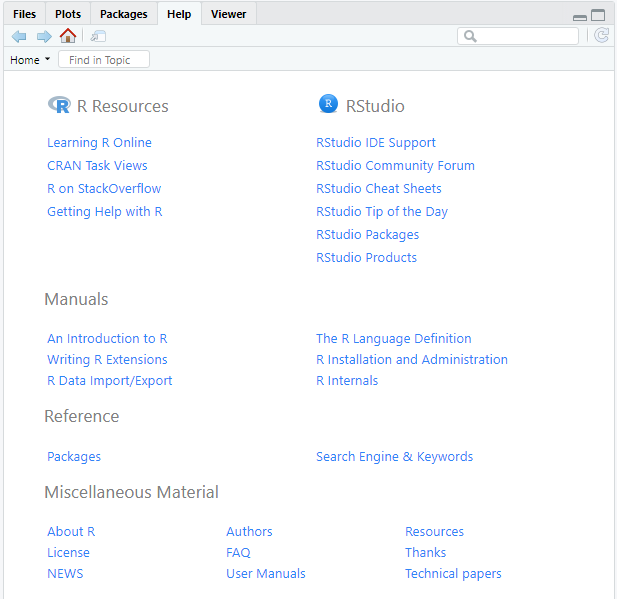

]

.pull-right[

- pomoc dotycząca funkcji

- na stronie domowej linki do materiałów o R

- zakładka otwierania po kliknięciu na F1, jeśli kursor znajduje się na nazwie funkcji

]

---

# Interfejs - Viewer

.pull-left[

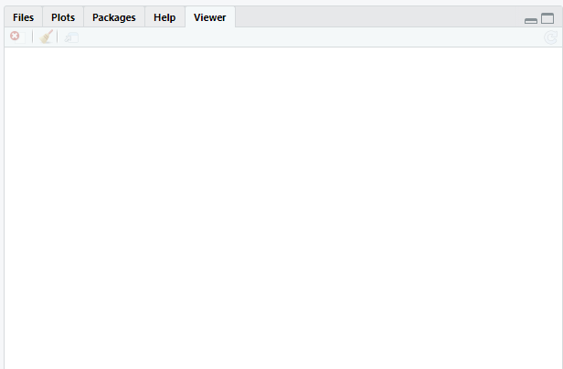

]

.pull-right[

- wyświetla elementy dynamiczne: wykresy, strony internetowe

]

---

# Interfejs - File

.pull-left[

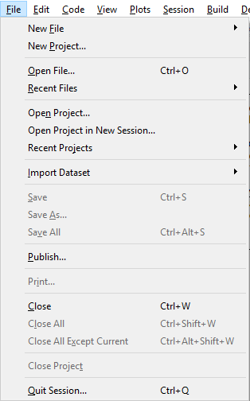

]

.pull-right[

- tworzenie nowego pliku

- tworzenie nowego projektu

- dostęp do projektów

- import pliku

- publikowanie na [RPubs](https://rpubs.com/)

- zamykanie plików

]

---

# Interfejs - Edit

.pull-left[

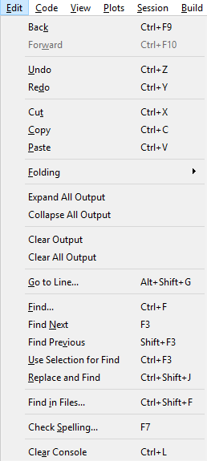

]

.pull-right[

- narzędzia edycji

- wyszukiwanie i zamiana

- sprawdzanie pisowni (dla j. angielskiego)

- czyszczenie konsoli

**Lista dostępnych opcji może się różnić w zależności od typu edytowanego pliku**

]

---

# Interfejs - Code

.pull-left[

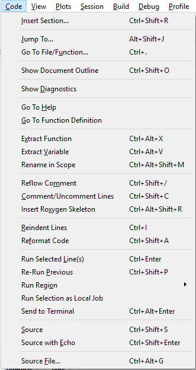

]

.pull-right[

Funkcje związane z edycją i wyglądem kodu

- wstawianie sekcji

- komentarze

- formatowanie kodu

- uruchamianie kodu

- wczytywanie kodu do pamięci

Większość z tych operacji będziemy wykonywać z wykorzystaniem skrótów klawiszowych

---

# Interfejs - View

.pull-left[

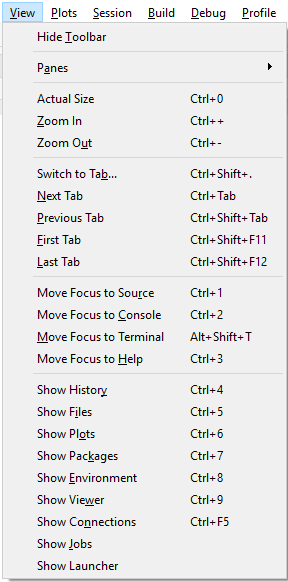

]

.pull-right[

Funkcje związane z układem RStudio

- przełączanie między plikami

- wybieranie paneli do wyświetlania

]

---

# Interfejs - Plots

.pull-left[

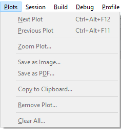

]

.pull-right[

Opcje wykresów

]

---

# Interfejs - Session

.pull-left[

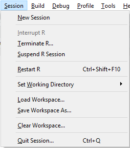

]

.pull-right[

- zakończenie R w przypadku braku reakcji 

- restart R

- przypisywanie katalogu roboczego

- zapisywanie/ładowanie/czyszczenie zawartości pamięci

]

---

# Interfejs - Debug

.pull-left[

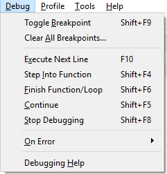

]

.pull-right[

Narzędzia debugowania kodu

]

---

# Interfejs - Profile

.pull-left[

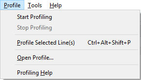

]

.pull-right[

Narzędzia profilowania kodu czyli sprawdzenie czasu wykonywania poszczególnych funkcji.

]

---

# Interfejs - Tools

.pull-left[

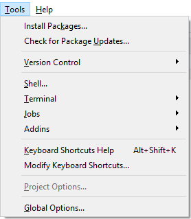

]

.pull-right[

- instalacja pakietów

- narzędzia kontroli wersji

- opcje projektu

- opcje globalne

]

---

# Interfejs - Help

.pull-left[

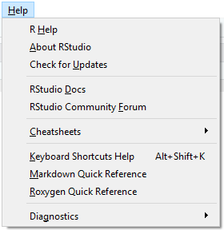

]

.pull-right[

- pomoc 

- ściągawki

]

---

# R club rules

- R jest wrażliwy na wielkość liter: dane i DANE to dwie różne rzeczy

- separatorem części dziesiętnej liczby jest kropka

- nazwa obiektu nie może zaczynać się od liczby

---

# Komentarze

> Real programmers don't comment their code. If it was hard to write it should be hard to understand.

--

**Komentarz** w R to znak `#`

```

# treść komentarza

```

Skrót klawiszowy: ctrl + shift + c - używany do tworzenia i usuwania komentarza

---

# Uruchamianie kodu R

- przycisk Run w oknie skryptu

- skrót klawiszowy: ctrl + enter (RStudio) lub ctrl + r (R)

**Scenariusz 1**

Umieszczamy kursor w linii, którą chcemy wywołać i podejmujemy akcję uruchomienia.

**Scenariusz 2**

Zaznaczamy fragment kodu i go uruchamiamy.

---

# Funkcja w R

```

nazwa_funkcji(argument1 = wartosc1, argument2 = wartosc2)

```

--

- wartości argumentów można deklarować używając nazw - nieważna kolejność

```

nazwa_funkcji(argument2 = wartosc2, argument1 = wartosc1)

```
--

- wartości argumentów można deklarować pozycyjnie - ważna kolejność

```

nazwa_funkcji(wartosc1, wartosc2, wartosc3)

```

---

<iframe src="https://embed.polleverywhere.com/multiple_choice_polls/YrwsEzbcP28kG9ZqfpKc1?controls=none&short_poll=true" width="100%" height="100%" frameBorder="0"></iframe>

---

# Obiekty

W R wszystko może być obiektem: zbiór danych, wykres, mapa. 

Operator przypisania w R to `<-`

```
nazwa <- obiekt
```

Można także korzystać ze znaku równości `=`, ale nie jest to zalecane, ponieważ ten znak pojawia się w wielu innych miejscach, a `<-` oznacza wyłącznie stworzenie obiektu.

---

# Obiekty

.pull-left[

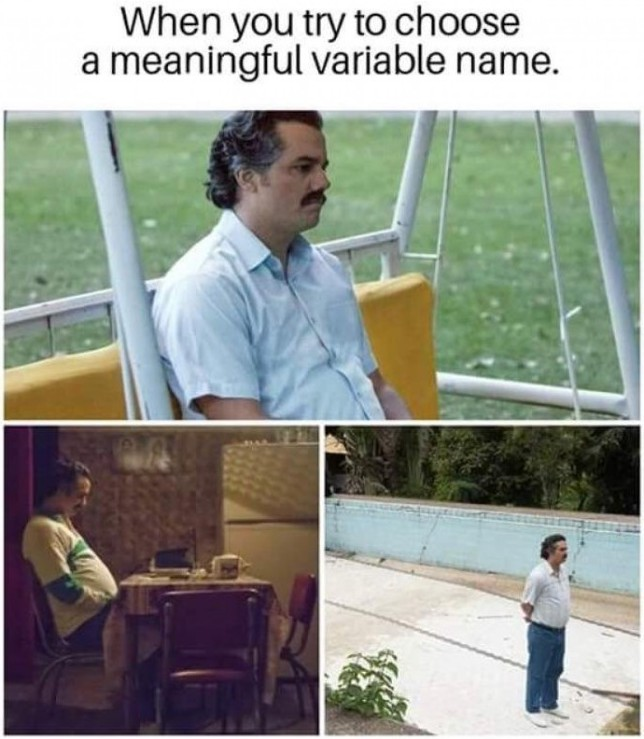

]

.pull-right[

Konwencje nazywania obiektów:

- alllowercase

- period.separated

- underscore_separated

- lowerCamelCase

- UpperCamelCase

]

---

# Typy obiektów

- wartości

- wektor

- czynnik/faktor

- macierz

- lista

- ramka danych

- ...

---

class: inverse

# Zadanie

Oblicz w R wartość wyrażenia i przypisz wynik do obiektu.

$$log_{10}100 + \sqrt{121}$$

---

<iframe src="https://embed.polleverywhere.com/multiple_choice_polls/tcupHkZT8D1BA865uFQ7u?controls=none&short_poll=true" width="100%" height="100%" frameBorder="0"></iframe>

---

# Zestaw analityka - tidyverse

.pull-left[
```
install.packages("tidyverse")
```

- readxl - wczytywanie plików Excela
- haven - wczytywanie plików SAS, SPSS, Stata
- jsonlite - wczytywanie JSON
- xml2 - wczytywanie XML
- httr - dostęp do stron html
- rvest - web scraping
- DBI - dostęp do baz danych
- lubridate - operacje na datach
- hms - operacje na czasie dnia
- blob - przechowywanie danych binarnych
- magrittr - przetwarzanie potokowe `%>%`
- glue - łączenie tekstów

]

.pull-right[
```
library("tidyverse")
```

- ggplot2 - wykresy
- dplyr - przetwarzanie danych
- tidyr - porządkowoanie danych
- readr - wczytywanie plików tekstowych
- purrr - programowanie funkcyjne
- tibble - format dla zbiorów
- stringr - operacje na tekstach
- forcats - operacje na czynnikach

]

[Strona projektu Tidyverse](https://www.tidyverse.org/)

---

# Instalacja vs. wczytywanie


[źródło](https://twitter.com/visnut/status/1248087845589274624)

---

# Struktura projektu

```
project/
├── data/
├── docs/
├── figs/
├── output/
├── 01_input.R
└── 02_analysis.R
```

---

# Pliki tekstowe i csv

- `read.table()` - ogólna funkcja do plików tekstowych

- `read.csv()` - uwzględnia nagłówek, separator kolumn to przecinek, separator miejsc dziesiętnych to kropka

- `read.csv2()` - uwzględnia nagłówek, separator kolumn to średnik, separator miejsc dziesiętnych to przecinek

---

# Pliki Excela

Pakiet _readxl_:

- `read_excel()` - określa format na podstawie pliku

- `read_xls()` - wczytuje pliki .xls

- `read_xlsx()` - wczytuje pliki .xlsx

---

# Zapisywanie danych

Zapisywanie do formatu R:

- `save(dane, file = "zbior.RData")`

- `save(dane1, dane2, file = "zbior.RData")`

- `saveRDS(dane, file = "zbior.RDS")`

Zapisywanie do pliku tekstowego (txt, csv):

- `write.table(x = obiekt, file = "plik.csv", sep = ";", dec = ",", row.names = FALSE)`

Zapisywanie do pliku Excela z pakietem _openxlsx_:

- `write.xlsx(x = obiekt, file = "plik.xlsx")`

---

## Wczytywanie danych o formacie R

- `load("zbior.RData")`

- `dane <- readRDS("zbior.RDS")`

---

# Wczytanie zbioru danych

Importujemy zbiór danych dotyczących wyników wyborów prezydenckich w 2020 roku.

Plik z danymi: http://wawrowski.edu.pl/mr/data/wybory2020.xlsx

[Źródło](https://prezydent20200628.pkw.gov.pl/prezydent20200628/pl/dane_w_arkuszach)

---

class: inverse

# Zadanie

Wywołaj funkcję `summary()` na wczytanym zbiorze danych.

---

# Pakiet _janitor_ 

Surowe dane zwykle nie posiadają nazw kolumn przystosowanych do przetwarzania przez komputer

- nazwy zmiennych nie powinny zawierać polskich liter i spacji

- nazwy zmiennych nie powinny zaczynać się od liczby

Te problemy rozwiązuje pakiet _janitor_ (dozorca, woźny) i funkcja `clean_names()`:

```r

zbior <- janitor::clean_names(zbior)

```

- funkcja ta zamienia wielkie litery na małe, spacje na podkreślniki i znaki transliteruje do ASCII.

---

class: inverse

# Pytania do zbioru danych

1. Ile obwodów głosowania miało frekwencję powyżej 80%?

2. Ile obwodów głosowania znajduje się w Poznaniu?   

3. Ile jest obwodów według typu obszaru?

4. Jaka była średnia frekwencja w województwach?

5. Gdzie była największa różnica pomiędzy kandydatami?

```{r eval=FALSE, include=FALSE}
library(tidyverse)

raw_data <- readxl::read_xlsx("../data/wybory2020.xlsx")

raw_data <- janitor::clean_names(raw_data)

wp <- raw_data %>% 
  select(symbol_kontrolny:percent_glosow_niewaznych, percent_glosow_waznych:rafal_kazimierz_trzaskowski)
  
wp %>% filter(frekwencja > 70) %>% count()

wp %>% count(typ_obszaru)

wp %>% group_by(wojewodztwo) %>% summarise(srednia_frekwencja=mean(frekwencja)) %>% arrange(srednia_frekwencja)

diff <- wp %>% 
  mutate(roznica = abs(andrzej_sebastian_duda-rafal_kazimierz_trzaskowski))

```

---

<center>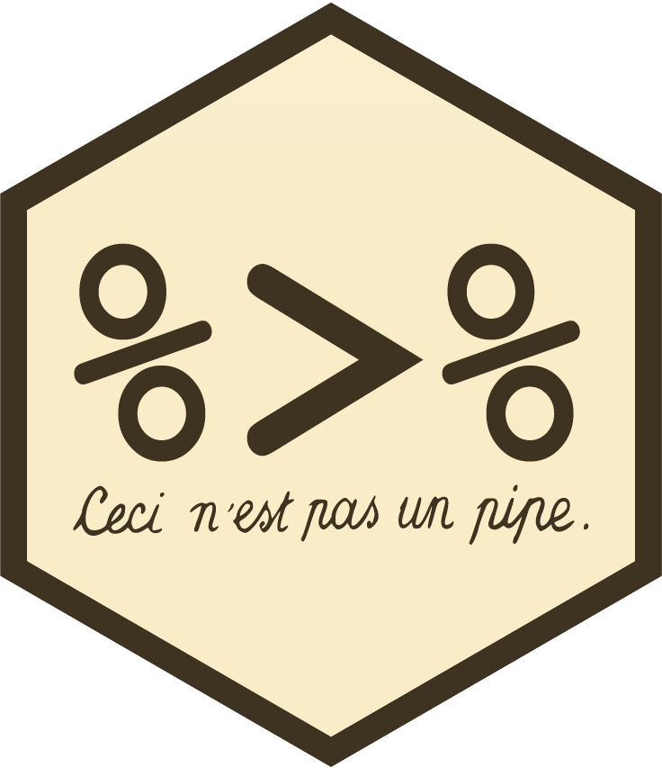</center>

---

# Przetwarzanie potokowe

```
obudź się %>%
  wyjdź z łóżka %>%
  skorzystaj z łazienki %>%
  zjedź śniadanie %>%
  ubierz się %>%
  idź do pracy
```

---

# Przetwarzanie potokowe

Użycie operatora **pipe**: `%>%` (łącznik) ułatwia zarządzanie kodem i pisanie czytelnej składni poprzez wykorzystanie istniejących struktur danych:

- nie trzeba tworzyć wielu nowych obiektów

- nie trzeba zagnieżdżać w sobie wielu funkcji

Znak `%>%` oznacza, że jako argument wejściowy `data` w kolejnej funkcji zostanie wpisany wynik działania wcześniejszej funkcji

--

Skrót klawiszowy: ctrl + shift + m

---

<iframe src="https://embed.polleverywhere.com/multiple_choice_polls/3pasJF1K87E5wDsVRmdEk?controls=none&short_poll=true" width="100%" height="100%" frameBorder="0"></iframe>

---

# Wybrane funkcje

- `select()` - wybór zmiennych

- `filter()` - wybór obserwacji

- `mutate()` - tworzenie/modyfikacja zmiennej

- `rename()` - zmiana nazwy zmiennej

- `count()` - zliczanie obserwacji

- `summarise()` - podsumowania danych

- `group_by()` - operowanie na grupach

---

class: inverse

# Zadanie

`r countdown(minutes = 3, seconds = 0, top = 0)`

Jaki średni wynik uzyskał Andrzej Duda na statkach?

```{r eval=FALSE, include=FALSE}
wp %>% 
  group_by(typ_obszaru) %>% 
  summarise(sr=mean(rafal_kazimierz_trzaskowski))
```

---

<iframe src="https://embed.polleverywhere.com/multiple_choice_polls/VvMLAuXsBKkJyrWo92Rno?controls=none&short_poll=true" width="100%" height="100%" frameBorder="0"></iframe>

---

class: inverse, center, middle

# Pytania?