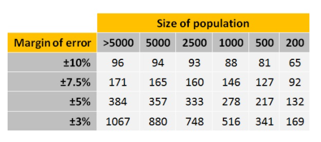

```{r include=FALSE}
library(tidyverse)
library(countdown)
```

# Minimalna liczebność próby

Minimalna liczebność próby (MLP) informuje ile jednostek należy przebadać, aby maksymalny błąd oszacowania (na poziomie ufności $1–\alpha$) wyniósł co najwyżej $d$.

Przy większej liczbie jednostek oszacowanie będzie bardziej trafne (przedział ufności będzie węższy). Z drugiej strony koszty badania rosną wraz ze wzrostem liczebności próby.

Szukamy kompromisu pomiędzy dokładnością, a liczbą badanych jednostek.

---

# Podejście kosztowe

Badane jest tyle jednostek na ile pozwala założony budżet.

$$n = \frac{\text{budżet} - \text{koszty stałe}}{\text{koszt jednostkowy}}$$

Przykład:

$$n=\frac{25000-5000}{20}=1000$$

W tym podejściu nie bierzemy pod uwagę błędu oszacowania.

---

## Podejścia oparte o przedział ufności

Do wyznaczenia minimalnej liczebności niezbędne jest ustalenie:

- poziomu prawdopodobieństwa (poziomu istotności) - $\alpha$
- maksymalnego dopuszczalnego błędu pomiaru - $d$
- odsetek/odchylenie standardowe z badania pilotażowego - $p_0$ lub $\sigma$

[Kalkulator minimalnej liczebności próby](https://www.statystyka.az.pl/dobor/kalkulator-wielkosci-proby.php)

---

# Przedział ufności dla średniej

$$P\left\{\bar{X}-z_{(1-\alpha/2)}\frac{\sigma}{\sqrt{n}}<m<\bar{X}+z_{(1-\alpha/2)}\frac{\sigma}{\sqrt{n}}\right\}=1-\alpha$$
gdzie:

- $m$ - prawdziwa wartość średniej w populacji,
- $\bar{X}$ - estymator średniej z próby,
- $z_{(1-\alpha/2)}$ - kwantyl rozkładu normalnego obliczony dla poziomu istotności $\alpha$,
- $\sigma$ - znane odchylenie standardowe,
- $n$ - liczebność próby.

Błąd oszacowania to wynik odejmowania i dodawania od i do średniej z próby.

--

Przykładowo: przedział ufności czasu pracy w ciągu tygodnia wynosi $(35,45)$ godzin. Zatem średnia z próby wynosi 40 godzin, a błąd 5 godzin.

---

### MLP - wyprowadzenie

$$P\left\{\bar{X}-z_{(1-\alpha/2)}\frac{\sigma}{\sqrt{n}}<m<\bar{X}+z_{(1-\alpha/2)}\frac{\sigma}{\sqrt{n}}\right\}=1-\alpha$$
Za błąd odpowiada: 

$$z_{(1-\alpha/2)}\frac{\sigma}{\sqrt{n}}$$

Chcemy, żeby błąd był mniejszy od tego wyrażenia:

$$d \geq z_{(1-\alpha/2)}\frac{\sigma}{\sqrt{n}}$$
Zatem po przekształceniach:

$$\sqrt{n} \geq z_{(1-\alpha/2)}\frac{\sigma}{d}$$
Otrzymujemy wzór na minimalną liczebność próby:

$$n \geq \left(z_{(1-\alpha/2)}\frac{\sigma}{d}\right)^2$$

---

# MLP - szacowanie średniej (I)

Znane odchylenie standardowe w populacji.

$$n \geq \left(z_{(1-\alpha/2)} \cdot \frac{\sigma}{d}\right)^2$$

gdzie: 

- $z_{1-\alpha/2}$ - kwantyl rozkładu normalnego obliczony dla poziomu istotności $\alpha$
- $\sigma$ - odchylenie standardowe w populacji
- $d$ - maksymalny dopuszczalny błąd pomiaru

---

# MLP - szacowanie średniej (II)

Nieznane odchylenie standardowe w populacji.

$$n \geq \left(t_{(1-\alpha/2,n_0-1)} \cdot \frac{s}{d}\right)^2$$

gdzie: 

- $t_{(1-\alpha/2,n_0-1)}$ - kwantyl rozkładu t-Studenta obliczony dla poziomu istotności $\alpha$ i dla stopni swobody $n_0-1$
- $n_0$ - wielkość próby w badaniu pilotażowym
- $s$ - odchylenie standardowe w badaniu pilotażowym
- $d$ - maksymalny dopuszczalny błąd pomiaru

---

# MLP - szacowanie odsetka (I)

Znany szacunkowy odsetek.

$$n \geq z_{(1-\alpha/2)}^2 \cdot \frac{p_0(1-p_0)}{d^2}$$

gdzie: 

- $z_{1-\alpha/2}$ - kwantyl rozkładu normalnego obliczony dla poziomu istotności $\alpha$
- $p_0$ - znany szacunkowy odsetek
- $d$ - maksymalny dopuszczalny błąd pomiaru

---

# MLP - szacowanie odsetka (II)

Nieznany szacunkowy odsetek.

$$n \geq z_{(1-\alpha/2)}^2 \cdot \frac{1}{d^2}$$

gdzie: 

- $z_{1-\alpha/2}$ - kwantyl rozkładu normalnego obliczony dla poziomu istotności $\alpha$
- $d$ - maksymalny dopuszczalny błąd pomiaru

---

# Wartości kwantyli N(0,1)

| Prawdopodobieństwo | Poziom istotności | Kwantyl rozkł. norm.|
|-------------------:|------------------:|--------------------:|
| 99% (0,99) | 0,01 | 2,58 | 
| 95% (0,95) | 0,05 | 1,96 |
| 90% (0,90) | 0,10 | 1,64 |

Wyznaczanie wartości kwantyli w R:

- `qnorm(p = 1-alfa/2)`
- `qt(p = 1-alfa/2, df = n0-1)`

---

# Przykładowe wartości



[źródło](http://www.tools4dev.org/resources/how-to-choose-a-sample-size/)

---

# MLP - szacowanie odsetka (I)

```{r echo=FALSE, fig.width=10}
expand.grid(alfa=c(0.1, 0.05, 0.01), 
            p0=seq(0.01, 0.99, 0.01),
            d=c(0.01,0.03,0.05)) %>% 
  mutate(z=qnorm(1-alfa/2),
         n=ceiling(z^2*p0*(1-p0)/d^2)) %>% 
  ggplot(aes(x=p0, y=n, color=as.factor(d))) + 
  geom_point() + 
  scale_color_discrete(name = "d") +
  facet_wrap(~ alfa) +
  theme_light() +
  theme(legend.position = "bottom") +
  ggtitle("Minimalna liczebność próby w zależności od parametrów alfa, d i p0")
```

---

# MLP - maksymalne wartości

```{r echo=FALSE, message=FALSE, warning=FALSE}
expand.grid(alfa=c(0.1, 0.05, 0.01), 
            p0=seq(0.01, 0.99, 0.01),
            d=c(0.01,0.03,0.05)) %>% 
  mutate(z=qnorm(1-alfa/2),
         n=ceiling(z^2*p0*(1-p0)/d^2)) %>%
  group_by(d, alfa) %>% 
  summarise(maksimum_n=max(n)) %>% 
  knitr::kable()
```


---

# Przykład

Chcemy oszacować odsetek mieszkańców Poznania, którzy są zadowoleni z życia zakładając błąd badania równy 3% i prawdopodobieństwo 95%. 

--

Według Badania Spójności Społecznej w 2018 roku zadowolonych z życia było 73% polaków [(GUS 2020) ](https://stat.gov.pl/obszary-tematyczne/warunki-zycia/dochody-wydatki-i-warunki-zycia-ludnosci/jakosc-zycia-i-kapital-spoleczny-w-polsce-wyniki-badania-spojnosci-spolecznej-2018,4,3.html)


```{r eval=FALSE, include=FALSE}
ceiling(qnorm(1-0.05/2)^2*0.73*(1-0.73)/0.03^2)
```

---

# Losowanie próby

```{r}
set.seed(123)

N <- 535946
m <- round(0.73*N)

populacja <- c(rep(1, m), rep(0, N-m))

n_min <- 842

proba <- sample(populacja, n_min)

sum(proba)/n_min
```

---

### Symulacja wielokrotnego losowania

```{r}
wynik_1k <- numeric(1000)

for(sym in 1:1000){
  
  proba <- sample(populacja, n_min)

  wynik_1k[sym] <- sum(proba)/n_min

}

summary(wynik_1k)

sum(wynik_1k > 0.7 & wynik_1k < 0.76)/1000
```

---

class: inverse, center, middle

# Pytania?