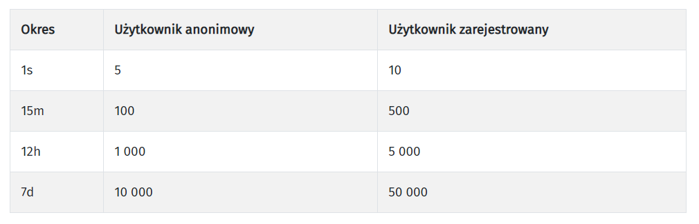

```{r include=FALSE}
knitr::opts_chunk$set(message = F, warning = F, comment = NA)

library(tidyverse)
library(countdown)
options(scipen=100)
set.seed(123)

load("../data/wybory.rda")
```

# Wprowadzenie

Link do ankiet: https://pollev.com/lukaszw470

---

<iframe src="https://embed.polleverywhere.com/multiple_choice_polls/50nCDwz03vSmpuU9LCQS6?controls=none&short_poll=true" width="100%" height="100%" frameBorder="0"></iframe>

---

<iframe src="https://embed.polleverywhere.com/multiple_choice_polls/h61kQcUAi9ONnaIDJVzDA?controls=none&short_poll=true" width="100%" height="100%" frameBorder="0"></iframe>

---

# Problem

Przeprowadzić badanie exit-poll mając do dyspozycji 100 ankieterów.

---

# Próba losowa

Próba jest losowa jeśli spełnione są następujące warunki:

--

1. Każda jednostka w populacji generalnej posiada niezerowe prawdopodobieństwo znalezienia się w próbie - $\pi_i$.

2. Prawdopodobieństwo $\pi_i$ jest znane dla każdej jednostki w próbie.

3. Każda para jednostek w populacji generalnej posiada niezerowe prawdopodobieństwo znalezienia się w próbie - $\pi_{ij}$.

4. Prawdopodobieństwo $\pi_{ij}$ jest znane dla każdej pary jednostek w próbie.

---

# Liczba możliwych prób

Dwumian Newtona: ${n\choose k}=\frac{n!}{k!\cdot(n-k)!}$

- Losowanie próby o liczebności 4 z populacji o liczebności 10

```{r}
choose(10,4)
```

- Losowanie próby o liczebności 10 z populacji o liczebności 200

```{r}
choose(200,10)
```

---

# Schemat doboru próby

Procedura określająca w jaki sposób mają być dobierani respondenci. Schemat doboru próby określa:

- liczebność próby
- sposób losowania
- sposób warstwowania próby
- alokację próby pomiędzy warstwy
- liczbę poziomów losowania

[Dodatkowo do poczytania](http://nastrazysondazy.uw.edu.pl/metodologia-badan/metodologia/korekty-danych-i-wazenie-danych/)

---

# Losowanie proste

Prawdopodobieństwo dostania się do próby jest takie samo dla wszystkich jednostek.

- funkcja `sample_n()` oraz `sample_frac()`

--

> "Ene due rike fake" i inne wyliczanki nie są sprawiedliwą i losową metodą wyłaniania ochotnika, gdyż podzielenie liczby sylab w wyliczance przez liczbę uczestników pozwala przewidzieć rezultat wyliczania i otwiera pole do manipulacji.


---

### Prawdopodobieństwo i waga z próby

Prawdopodobieństwo dostania się (inkluzji) do próby:

$$\pi_i=\frac{\text{liczebność próby}}{\text{liczebność populacji}}$$
Waga z próby:

$$w_i=1/\pi_i=\frac{\text{liczebność populacji}}{\text{liczebność próby}}$$

---

### Prawdopodobieństwo i waga z próby

Losujemy próbę o wielkości 38 000 osób z Polski (populacja 38 milionów). Prawdopodobieństwo wylosowania pojedyńczej jednostki wynosi:

$$\pi_i=38000/38000000=1/1000$$

Każda osoba w próbie reprezentuje 1000 mieszkańców Polski.

W związku z tym waga z próby jest równa:

$$w_i=1/\pi_i=1000$$

Suma wag z próby powinna być równa liczebności populacji.

---

# Losowanie proste w R

```{r}
proba_prosta <- dane_czyste %>% 
  sample_n(500) %>% 
  mutate(prob=n()/nrow(dane_czyste),
         waga=1/prob)

sum(proba_prosta$waga)
```

---

### Struktura w próbie i populacji

.pull-left[

```{r}
dane_czyste %>% 
  count(wojewodztwo) %>% 
  mutate(proc=n/nrow(dane_czyste)*100)
```
]

.pull-right[

```{r}
proba_prosta %>% 
  count(wojewodztwo) %>% 
  mutate(proc=n/nrow(proba_prosta)*100)
```
]

---

# Porównanie

```{r echo=FALSE, fig.width=12}
pop <- dane_czyste %>% 
  count(wojewodztwo) %>% 
  mutate(proc=n/nrow(dane_czyste)*100)

proba <- proba_prosta %>% 
  count(wojewodztwo) %>% 
  mutate(proc=n/nrow(proba_prosta)*100)

p <- data.frame(populacja = pop$proc, proba = proba$proc, woj = pop$wojewodztwo) %>% 
  ggplot(aes(x=populacja, y=proba, label = woj)) +
  geom_point() +
  geom_abline(slope = 1) +
  xlim(0,20) +
  ylim(0,20) +
  theme_minimal() 

plotly::ggplotly(p)
```


---

# Pakiet _sampling_

Pakiet [sampling](https://cran.r-project.org/web/packages/sampling/index.html) oferuje funkcje służące do losowania prób z wykorzystaniem różnych schematów losowania.

---

# Losowanie proporcjonalne

Losowanie z prawdopodobieństwami proporcjonalnymi do wartości cechy.

W funkcji `sample_n` lub `sample_frac` należy podać argument `weight`.

Aby wyznaczyć te prawdopodobieństwa w populacji korzysta się z funkcji:

```
inclusionprobabilities(a = cecha, n = liczebnosc_proby)
```

---

# Losowanie proporcjonalne

```{r}
library(sampling)

proba_prop <- dane_czyste %>% 
  sample_frac(size = 0.05, weight = frekwencja)
```

Wyznaczenie prawdopodobieństwa

```{r}
dane_czyste_prop <- dane_czyste %>% 
  mutate(p_prop=inclusionprobabilities(frekwencja, 500))
```

---

# Losowanie proporcjonalne

```{r}
proba_prop <- dane_czyste_prop %>% 
  sample_n(500, weight = p_prop) %>% 
  mutate(waga=1/p_prop)

sum(proba_prop$waga)
```

W losowaniu propocjonalnym suma wag nie jest równa liczebności populacji.

---

# Losowanie warstwowe

Operat jest dzielony na warstwy, w którym stosuje się losowanie proste.

Funkcja `strata`

```r
strata(data, stratanames, size)
```

- trzeba podać liczebność dla każdej warstwy

---

# Pakiet bdl

- korzysta z [API BDL](https://api.stat.gov.pl/Home/BdlApi)

- limity:



- strona projektu na [github](https://github.com/statisticspoland/R_Package_to_API_BDL)

---

# Poziom zasilenia danych

- 0 - Polska

- 1 - makroregion

- 2 - województwo

- 3 - region

- 4 - podregion

- 5 - powiat

- 6 - gmina

---

# Wyszukiwanie danych (I)

Hierarchia: Kategorie -> Grupy -> Podgrupy -> Tematy

- `get_subjects()` - pobiera dane o kategoriach/grupach/podgrupach

- `search_subjects()` - wyszukuje dane o tematach

  - `name` - szukana fraza
  - `subjectId` - kod narzędnego tematu
  - `level` - poziom zasilenia danych
  - `year` - lata obowiązywania
  - `sort` - klucz sortowania
  
---

# Wyszukiwanie danych (II)
  
- `get_variables()` - pobiera dane o zmiennej  
  
- `search_variables()` - wyszukuje dane o zmiennej

---

# Wyszukiwanie danych (III)

- `get_units()` - pobiera dane o jednostce terytorialnej

- `search_units()` - wyszukuje dane o jednostce terytorialnej
  
---

# Jedna zmienna i wiele jednostek

Pobieranie za pomocą funkcji `get_data_by_variable()`:

- `varId` - kod zmiennej

- `unitParentId` - kod jednostki nadrzędnej (opcjonalnie)

- `unitLevel` - poziom zasilenia danych

- `year` - lata obowiązywania

---

# Wiele zmiennych i jedna jednostka

Pobieranie za pomocą funkcji `get_data_by_unit()`:

- `unitId` - kod NUTS jednostki

- `varId` - kod zmiennej lub kody zmiennych

- `year` - lata obowiązywania

- `type` - "code" (domyślnie) albo "label"

---

# Losowanie zespołowe

Z operatu losowane są całe grupy (zespoły).

Funkcja `cluster`

```r
cluster(data, clustername, size)
```

---

# Losowanie systematyczne

Losowanie co k-tej jednostki.

Funkcja `UPsystematic`

```r
UPsystematic(pik)
```

- operuje na prawdopodobieństwach, zatem wielkość próby należy określić wcześniej

---

class: center, middle, inverse

# Pytania?