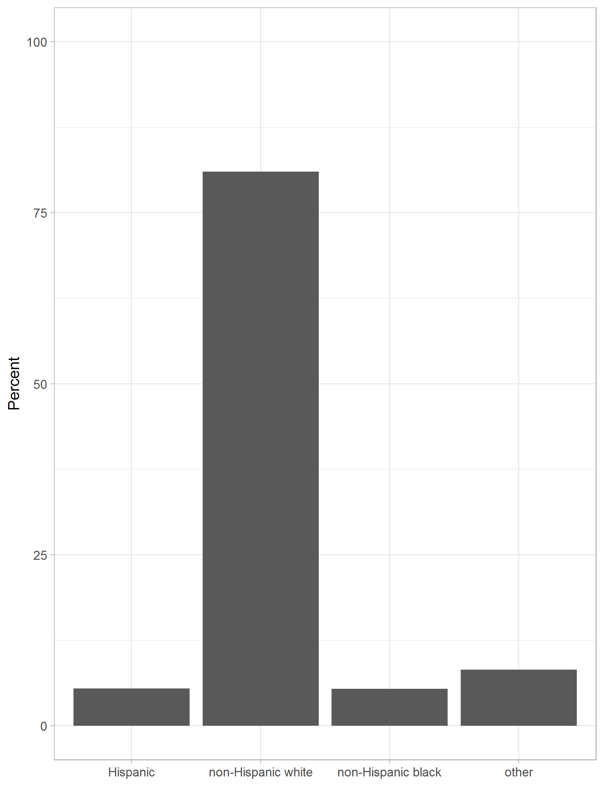

```{r include=FALSE}
library(tidyverse)
library(countdown)
options(scipen=100)
```

<iframe src="https://embed.polleverywhere.com/multiple_choice_polls/rYdWmXtOiJ2THuATIOIsr?controls=none&short_poll=true" width="100%" height="100%" frameBorder="0"></iframe>

---

<iframe src="https://embed.polleverywhere.com/multiple_choice_polls/6QaBgaNDbxqZOkR4TfuXB?controls=none&short_poll=true" width="100%" height="100%" frameBorder="0"></iframe>

---

<iframe src="https://embed.polleverywhere.com/multiple_choice_polls/JkpDFpC1Q8SJFPwNzEbJ4?controls=none&short_poll=true" width="100%" height="100%" frameBorder="0"></iframe>

---

# Wprowadzenie

> Statystycy są chyba jedynymi specjalistami, którzy nie tylko dumnie oświadczają, że udzielane przez nich odpowiedzi najprawdopodobniej są obarczone błędem, ale też dokładają wszelkich starań, by precyzyjnie określić wielkość tego błędu.

Bruce Frey, _75 sposobów na statystykę. Jak zmierzyć świat i wygrać z prawdopodobieństwem_

---

# Problem

Oszacować wyniki wyborów prezydenckich na podstawie próby około 900 obwodów wyborczych.

---

# Dane

Losowanie około 900 obwodów stałych - zbiór danych `wybory_proba.rda`.

**Próba nr 1**

Warstwowanie przez województwo (16), liczbę wyborców (3) i frekwencję (4). W sumie uzyskano 192 warstwy.

**Próba nr 2**

Warstwowanie przez województwo (16), liczbę wyborców (3), frekwencję (4) i różnicę wyników (2). Mało liczne warstwy zostały połączone. W sumie uzyskano 325 warstw.

[Kod źródłowy](https://github.com/lwawrowski/metoda-reprezentacyjna/blob/master/codes/2020_2021/losowanie_proby_obwodow.R)

---

class: inverse

# Zadanie

Jaki jest średni wynik urzędującego prezydenta w próbie nr 1?

`r countdown(minutes = 5, seconds = 0, top = 0)`

---

<iframe src="https://embed.polleverywhere.com/multiple_choice_polls/QY9y4Cwr5BqmtOQ4pmxJs?controls=none&short_poll=true" width="100%" height="100%" frameBorder="0"></iframe>

---

## Estymator

Statystyka służąca do szacowania wartości parametru rozkładu. 

Celem zastosowania estymatora jest znalezienie parametru rozkładu cechy w populacji.

**Nieobciążoność**

Estymator jest nieobciążony, jeśli wartość oczekiwana rozkładu estymatora jest równa wartości szacowanego parametru:

$E(\hat{\theta})=\theta$

**Efektywność**

Spośród zbioru wszystkich nieobciążonych estymatorów $\hat{\theta}_{1},\hat{\theta}_{2},\dots,\hat{\theta}_{r}$ najefektywniejszym nazywamy estymator o najmniejszej wariancji.

[Wikipedia 2020](https://pl.wikipedia.org/wiki/Estymator)

[Khan Academy](https://www.khanacademy.org/math/ap-statistics/sampling-distribution-ap/what-is-sampling-distribution/e/biased-unbiased-estimators)

---

# Obciążenie i wariancja


[Źródło](https://www.kdnuggets.com/2016/08/bias-variance-tradeoff-overview.html)

---

# Przykład 1

```{r include=FALSE}
set.seed(891)
test <- round(rnorm(1000, mean = 80, sd = 20))

test_sample <- numeric(60)

for(i in 1:length(test_sample)){
  
  test_sample[i] <- round(median(sample(test, 10)))
  
}
```


Fryderyk był ciekawy czy mediana z próby jest nieobciążonym estymatorem mediany w populacji. W populacji wyników z testu mediana wynosiła `r median(test)` punktów. 

Fryderyk wylosował z populacji 10 wyników i obliczył medianę. Proces powtórzył 60 razy. Wyniki symulacji przedstawione są na wykresie:

```{r echo=FALSE, fig.height=4, fig.width=8}
data.frame(test=test_sample) %>% 
  ggplot(aes(x = test)) + 
  geom_dotplot(binwidth = 1.5) +
  scale_y_continuous(NULL, breaks = NULL) +
  scale_x_continuous("Mediana z próby") +
  theme_light()
```
---

<iframe src="https://embed.polleverywhere.com/multiple_choice_polls/hV2dVZ8BuKAuzkwEspn3L?controls=none&short_poll=true" width="100%" height="100%" frameBorder="0"></iframe>

---

# Przykład 2

```{r echo=FALSE, fig.width=10, fig.height=6}
set.seed(12)
# nieobciążony, mała wariancja

test_sample1 <- numeric(60)

for(i in 1:length(test_sample)){
  
  test_sample1[i] <- round(median(sample(test, 90)))
  
}

df1 <- data.frame(est="Estymator 1", mediana = test_sample1)

# obciążony, mała wariancja

test_sample2 <- numeric(60)

for(i in 1:length(test_sample)){
  
  test_sample2[i] <- round(median(sample(test, 110))) - 10
  
}

df2 <- data.frame(est="Estymator 2", mediana = test_sample2)

# nieobciążony, duża wariancja

test_sample3 <- numeric(60)

for(i in 1:length(test_sample)){
  
  test_sample3[i] <- round(median(sample(test, 10)))
  
}

df3 <- data.frame(est="Estymator 3", mediana = test_sample3)

df <- rbind(df1, df2, df3)

ggplot(df, aes(x = mediana)) + 
  geom_dotplot(binwidth = 2) +
  facet_wrap(~ est, nrow = 1) +
  scale_y_continuous(NULL, breaks = NULL) +
  scale_x_continuous("Mediana z próby") +
  theme_light()
```

---

<iframe src="https://embed.polleverywhere.com/multiple_choice_polls/YQ8HuDidyDQoctzpU8rFV?controls=none&short_poll=true" width="100%" height="100%" frameBorder="0"></iframe>

---

### Estymator Horvitza-Thompsona

Estymator wartości globalnej 

$$\hat{\theta}^{HT}=\sum\limits_{i=1}^{n}{y_iw_i}$$

Estymator wartości średniej

$$\hat{\bar{\theta}}^{HT}=\frac{1}{n}\sum\limits_{i=1}^{n}{y_iw_i}$$

gdzie:

- $n$ - liczebność próby,
- $y_i$ - wartość cechy dla $i$-tej jednostki,
- $w_i$ - wartość wagi dla $i$-tej jednostki.

---

### Wariancja estymatora Horvitza-Thompsona

Dla prostego schematu losowania obowiązują następujące wzory:

- Estymator wartości średniej

$$V(\hat{\bar{\theta}}^{HT})=\frac{N-n}{N} \cdot \frac{s^2_y}{n}$$

- Estymator wartości globalnej 

$$V(\hat{\theta}^{HT})=\frac{N-n}{N}\cdot N^2 \cdot \frac{s^2_y}{n}$$

gdzie: 

- $N$ - liczebność populacji,
- $n$ - liczebność próby,
- $s^2_y$ - wariancja cechy $y$.

---

# Finite Population Correction

Różnica pomiędzy losowaniem ze zwracaniem, a losowaniem bez zwracania

$$\text{FPC}=\frac{N-n}{N}$$

[źródło](https://www.statisticshowto.datasciencecentral.com/finite-population-correction-factor/)

---

## Błąd standardowy oszacowania

Interpretowalną miarą błędu jest błąd standardowy:

$$\text{SE}=\sqrt{V(\hat{\theta}^{HT})}$$

--

Względny błąd oszacowania:

$$\text{CV}=\frac{\text{SE}}{\hat{\theta}^{HT}}$$

Podawany w procentach i wg standardów GUS nie powinien przekraczać 10%.

---

## Wyniki nieprzeważone i przeważone

.pull-left[


]

--

.pull-right[


]

---

# Pakiet [survey](https://cran.r-project.org/web/packages/survey/index.html)

- deklaracja schematu losowania

- estymacja wartości

- dane z badań reprezentacyjnych

- nazwy zmiennych należy poprzedzić tyldą $\sim$

- nazwy funkcji rozpoczynają się od `svy`

---

## Deklaracja schematu losowania

Określenie schematu losowania, żeby R mógł dobrać odpowiednie wzory do estymacji.

```{r eval=FALSE}
svydesign(ids = ~psu, strata = ~warstwa, weights = ~wagi, 
          nest = FALSE, data = zbior_danych)
```

- `ids` - jednostki losowania pierwszego stopnia

- `strata` - zmienna zawierająca identyfikator warstwy

- `weights` - zmienna zawierająca wagi z próby

- `nest` - wartość TRUE albo FALSE wskazująca czy wartości `id` są zagnieżdżone w `strata`

- `data` - zbiór danych

---

# Estymacja wartości średniej

```{r eval=FALSE}
svymean(x = ~cecha, design = schemat, na.rm = FALSE)
```

- `x` - estymowana cecha 

- `design` - schemat losowania określony za pomocą funkcji `svydesign()`

- `na.rm` - wartość TRUE albo FALSE wskazująca czy braki danych powinny być usunięte

---

class: inverse

# Zadanie

Oszacuj średni wynik Rafała Trzaskowskiego na podstawie próby nr 2.

`r countdown(minutes = 5, seconds = 0, top = 0)`

---

<iframe src="https://embed.polleverywhere.com/multiple_choice_polls/9R60lbCdNYsU1nj9So9A8?controls=none&short_poll=true" width="100%" height="100%" frameBorder="0"></iframe>

---

# Estymacja w grupach

```{r eval=FALSE}
svyby(formula = ~cecha, by = ~podzial, design = schemat, 
      FUN = funkcja, na.rm = FALSE)
```

- `formula` - estymowana cecha

- `by` - zmienna grupująca

- `design` - schemat losowania określony za pomocą funkcji `svydesign()`

- `FUN` - funkcja wykorzystana do estymacji np. `svytotal`

- `na.rm` - wartość TRUE albo FALSE wskazująca czy braki danych powinny być usunięte

---

class: inverse

# Zadanie

Oszacuj średni wynik Rafała Trzaskowskiego w przekroju województw na podstawie próby nr 2.

`r countdown(minutes = 10, seconds = 0, top = 0)`

---

<iframe src="https://embed.polleverywhere.com/multiple_choice_polls/j7BR5FbBfTsZmFPPjV0tY?controls=none&short_poll=true" width="100%" height="100%" frameBorder="0"></iframe>

---

# Estymacja wartości globalnej

```{r eval=FALSE}
svytotal(x = ~cecha, design = schemat, na.rm = FALSE)
```

- `x` - estymowana cecha 

- `design` - schemat losowania określony za pomocą funkcji `svydesign()`

- `na.rm` - wartość TRUE albo FALSE wskazująca czy braki danych powinny być usunięte

---

class: inverse

# Zadanie

Oszacuj liczbę osób głosujących na Rafała Trzaskowskiego na podstawie próby nr 2.

`r countdown(minutes = 10, seconds = 0, top = 0)`

---

# Przedział ufności

W jakim przedziale i z jakim prawdopodobieństwem znajduje się wartość prawdziwa:

$$\left(\hat{y}^{HT}- z_{1-\alpha/2}\cdot\sqrt{V(\hat{y}^{HT})} \leq \hat{y}^{HT} \leq \hat{y}^{HT}+ z_{1-\alpha/2}\cdot\sqrt{V(\hat{y}^{HT})}\right)$$

- 90% przedział ufności - $z_\alpha = 1,64$, dla $\alpha=0,10$
- 95% przedział ufności - $z_\alpha = 1,96$, dla $\alpha=0,05$
- 99% przedział ufności - $z_\alpha = 2,58$, dla $\alpha=0,01$

Obliczanie kwantyla rozkładu w R:

```{r}
qnorm(1-0.05/2)
```

---

# Funkcje z pakietu _stats_

Przedział ufności

```{r eval=FALSE}
confint(object = obiekt, level = 0.95)
```

- `object` - obiekt uzyskany z wykorzystaniem funkcji `svytotal`, `svyby`, ...

- `level` - długość przedziału ufności (0.90, 0.95, 0.99)

Względny błąd oszacowania

```{r eval=FALSE}
cv(object = obiekt)
```

- `object` - obiekt uzyskany z wykorzystaniem funkcji `svytotal`, `svyby`, ...

---

class: inverse

# Zadanie

Skonstruuj 90% przedziały ufności dla oszcowań średniego wyniku testu kompetencji (`api00`) w przekroju typu szkoły (`stype`). Czy wartości rzeczywiste znajdują się w tych przedziałach?

`r countdown(minutes = 10, seconds = 0, top = 0)`

---

# Estymacja wskaźnika

Ogółem

```{r eval=FALSE}
svyratio(numerator = ~licznik, denominator = ~mianownik, 
         design = schemat)
```

--

W grupach:

```{r eval=FALSE}
svyby(formula = ~licznik, denominator = ~mianownik, 
      by = ~podzial, design = schemat, FUN = svyratio)

```

---

class: inverse

# Zadanie

Oszacuj odsetek uczniów, którzy wzięli udział w teście kompetencji w przekroju typu szkoły (`stype`).

`r countdown(minutes = 10, seconds = 0, top = 0)`

---

class: center, middle, inverse

# Pytania?

