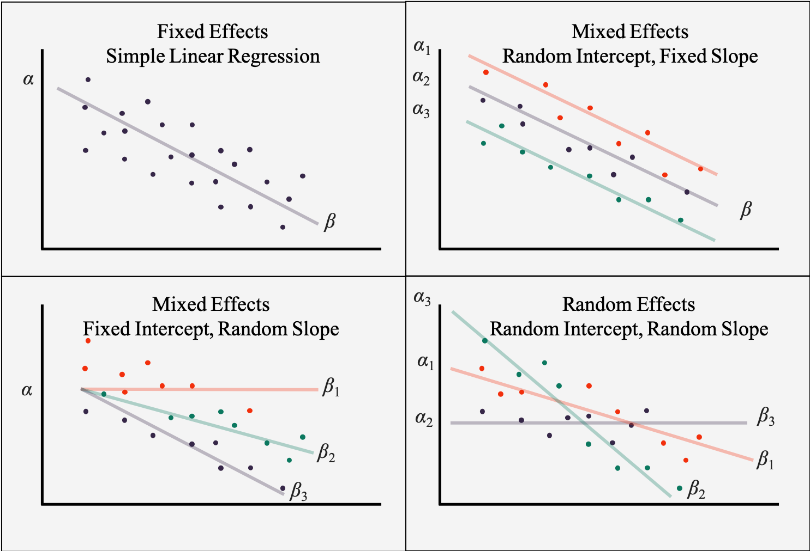

```{r include=FALSE}
library(tidyverse)
library(countdown)
options(scipen=100)
```

# Problem

Większość badań prowadzonych przez GUS należy do grupy badań częściowych (reprezentacyjnych), czyli takich, w których analizowana jest tylko mała część populacji. Dzięki zastosowaniu odpowiednich procedur oraz metod matematycznych możliwe jest wnioskowanie na temat populacji wyłącznie w oparciu o zebraną próbę. W takiej sytuacji oprócz oszacowanej wartości podaje się także błąd tego oszacowania. Przyjmuje się, że im mniejsza próba tym większy błąd oszacowania.

Oszacowania w szczegółowych przekrojach nie są publikowane na podstawie próby ze względu na wysokie błędy tych oszacowań. Przykładowo, stopa ubóstwa publikowana jest tylko w podziale na 6 regionów (na podstawie EU-SILC). 

Jeśli wartość względnego błędu oszacowania jest wyższa od przyjętego kryterium to można zastosować metody statystyki małych obszarów (estymacji pośredniej), które wykorzystują zmienne pomocnicze do poprawy precyzji oszacowań.

Określenie _statystyka małych obszarów_ nie odnosi się wyłącznie do małych obszarów terytorialnych, ale przede wszystkim przekrojów (grup), w których liczebność próby nie pozwala na uzyskanie precyzyjnych oszacowań.

---

# Główne zastosowania

- [rynek pracy](https://journals.sagepub.com/doi/abs/10.1177/1471082X13478873)
- [ubóstwo](https://onlinelibrary.wiley.com/doi/abs/10.1002/cjs.10051)
- [niepełnosprawność](https://ps.stat.gov.pl/Article/2018/4/449-472)
- [medycyna](https://cebp.aacrjournals.org/content/27/3/245.abstract)
- [rolnictwo](http://isas.org.in/jsp/volume/vol57/issueSV/jnkrao.pdf)
- [przedsiębiorczość](https://onlinelibrary.wiley.com/doi/abs/10.1111/sjos.12205)
- [przestępczość](https://academic.oup.com/bjc/advance-article-abstract/doi/10.1093/bjc/azaa067/5924614)
- [próby nielosowe - twitter](https://content.sciendo.com/configurable/contentpage/journals$002fjos$002f36$002f2$002farticle-p315.xml)
- [odpady komunalne](https://www.sciencedirect.com/science/article/pii/S0198971517305859)

[Publikacje z dwóch ostatnich lat](https://scholar.google.pl/scholar?as_ylo=2019&q=small+area+estimation&hl=pl&as_sdt=0,5)

---

# Estymacja bezpośrednia i pośrednia

Estymacja bezpośrednia - estymator Horvitza-Thompsona

- <span style="color: lightgreen;">nieobciążony </span>
- <span style="color: lightgreen;">obliczany wyłącznie na podstawie próby</span>
- <span style="color: red;">nie ma zastosowania w przypadku zerowej próby</span>
- <span style="color: red;">nieefektywny przy małej liczebności próby</span>

Estymacja pośrednia - model obszarowy

- <span style="color: lightgreen;">bogaty zbiór zmiennych pomocniczych</span>
- <span style="color: lightgreen;">może być stosowany w przypadku zerowej próby</span>
- <span style="color: red;">zależy od nieobserwowanej wariancji z próby</span>
- <span style="color: red;">wymaga spełnienia odpowiednich założeń</span>

Estymacja pośrednia - model jednostkowy

- <span style="color: lightgreen;">bardzo efektywny</span>
- <span style="color: lightgreen;">moze byc stosowany w przypadku zerowej próby</span>
- <span style="color: red;">niezbędne dane ze spisu powszechnego badz rejestru administracyjnego</span>
- <span style="color: red;">wymagający obliczeniowo</span>
- <span style="color: red;">wymaga spełnienia odpowiednich założeń</span>

---

# Wybrana literatura po polsku

- [Grażyna Dehnel, Michał Pietrzak, Łukasz Wawrowski - Estymacja przychodu przedsiębiorstw na podstawie modelu Faya-Herriota](http://yadda.icm.edu.pl/yadda/element/bwmeta1.element.ekon-element-000171464153)

- [Józefowski Tomasz, Szymkowiak Marcin - Zastosowanie estymatora typu SPREE w szacowaniu liczby osób bezrobotnych w przekroju podregionów](https://bazawiedzy.ue.poznan.pl/docstore/download/UEP3e706c47fbc841fb80c19b5d64fdedf3/07_jozefowski_szymkowiak.pdf)

- [Łukasz Wawrowski - Estymacja pośrednia wskaźników ubóstwa na poziomie powiatów](https://ws.stat.gov.pl/Article/2020/8/007-026)

- [Kamil Wilak - Strukturalne modele szeregów czasowych w estymacji stopy bezrobocia w dezagregacji na województwa, płeć i wiek](http://cejsh.icm.edu.pl/cejsh/element/bwmeta1.element.desklight-eb9d28e4-5e5f-455d-8ae7-7165889d4bc6)

---

# Zadanie

Poprawa jakości oszacowań stopy bezrobocia na poziomie powiatów - zbiór danych `stopa_bezr.rda`.

--

Ile wynosi średnia wartość względnego błędu oszacowania stopy bezrobocia?

---


---

# Liniowy model mieszany

Model z efektem stałym

$$y = x'\beta + e$$

Model z efektem stałym i losowym

$$y = x'\beta + u + e$$

---

# Liniowy model mieszany



[źródło](https://bookdown.org/steve_midway/BHME/Ch5.html)

---

# Model Faya-Herriota (1979)

Zakłada się, że oszacowanie bezpośrednie $\hat{\theta}^{HT}_d$ parametru $\theta_d$ jest nieobciążone i można je zapisać jako:

$$\hat{\theta}^{HT}_d = \theta_d + e_d$$

gdzie $e_d\stackrel{ind}{\sim} N(0,\psi_{d})$. W praktyce wariancja $\psi_d$ nie jest znana, w związku z czym jest estymowana na podstawie próby.

W drugim etapie, model Faya-Herriota (FH) traktuje $\theta_d$ jako zmienną objaśnianą w modelu liniowym z jednym efektem losowym na poziomie obszaru:

$$\theta_d=x_d'\beta+u_d$$

gdzie $x_d$ - wektor zmiennych objaśniających dla obszaru $d$ o wymiarach $p \times 1$, $\beta$ - wektor parametrów regresji oraz $u_d$ - efekt obszaru o $u_d\stackrel{iid}{\sim}N(0,\sigma^2_u)$.

W związku z tym model Faya-Herriota jest wariantem modelu liniowego z jednostkową strukturą kowariancji:

$$\theta_d=x_d'\beta+u_d+e_d$$

---

# Estymator modelu FH

Estymatorem tego modelu jest średnia ważona oszacowania bezpośredniego $\hat{\theta}_{d}^{HT}$ oraz oszacowania syntetycznego regresyjnego $x_d^{T}\hat{\beta}$. Waga $\gamma_d \in \left\langle 0,1\right\rangle$ mierzy niepewność wynikającą z opisu szacowanej wartości przez model regresyjny. W zależności od wariancji z próby $\psi_d$ oraz wariancji międzyobszarowej $\sigma_u^2$ większy bądź mniejszy udział będzie przypisywany szacunkowi bezpośredniemu. 

$$\hat{\theta}_{d}^{FH}=x_d^{T}\hat{\beta} + \hat{u}_d = \hat{\gamma}_d\hat{\theta}_{d}^{HT} + (1-\hat{\gamma}_d)x_d^{T}\hat{\beta},\; d=1, ..., D,$$

gdzie: $\hat{\gamma}_d=\frac{\hat{\sigma}^2_u}{\hat{\sigma}^2_u+\psi_d}$, a $\hat{\beta}$ jest wyznaczone z wykorzystaniem ważonej metody najmniejszych kwadratów.

W przypadku stosowania metod bazujących na modelu ważne jest zadbanie o spełnienie założeń. W przypadku modelu Faya-Herriota jest to założenie o normalności efektów losowych $\hat{u}_d=\hat{\gamma}_d(\hat{\theta}_{d}^{HT}-x_d^{T}\hat{\beta})$ oraz reszt $r=\hat{\theta}_{d}^{HT}-x_d^{T}\hat{\beta}$.

---

# Pakiet emdi

**Estimating and Mapping Disaggregated Indicators**

[The R Package emdi for Estimating and Mapping Regionally Disaggregated Indicators](https://cran.r-project.org/web/packages/emdi/vignettes/vignette_emdi.pdf)

[A Framework for Producing Small Area Estimates Based on Area-Level Models in R](https://cran.r-project.org/web/packages/emdi/vignettes/vignette_fh.pdf)

```r
fh(fixed, vardir, combined_data, domains)
```

- `fixed` - model w zapisie `y ~ x1 + x2 + x3`

- `vardir` - nazwa kolumny zawierającej wariancje oszacowań

- `combined_data` - zbiór danych

- `domains` - nazwa kolumny z nazwami jednostek np. powiaty

- `MSE` - czy obliczać błąd oszacowania `TRUE/FALSE`

---

# Zadanie

Jako cechy pomocnicze wykorzystamy:

- $x_1$ - ludność w wieku nieprodukcyjnym na 100 osób w wieku produkcyjnym
- $x_2$ - zasięg korzystania ze środowiskowej pomocy społecznej

W pierwszej kolejności dopasujemy model regresji liniowej, a następnie model Faya-Herriota.

---

# Zadanie

Ile wynosi średni względny błąd oszacowań uzyskanych na podstawie modelu Faya-Herriota?

---


---

- wyższa wartość błędu oszacowania pociąga za sobą większą/mniejszą wartość gamma

- 

---

class: center, middle, inverse

# Pytania?

