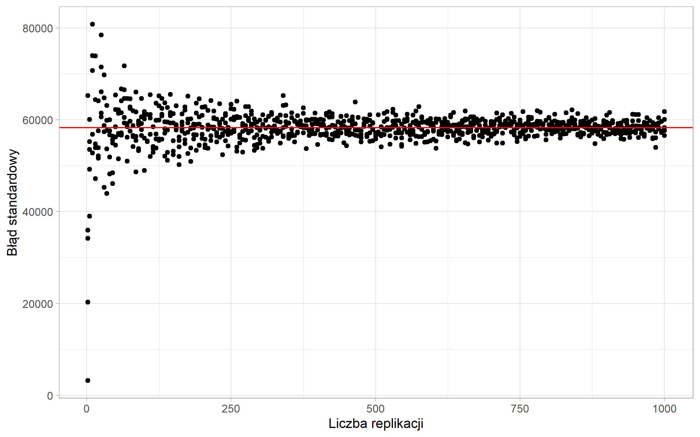

```{r include=FALSE}
library(tidyverse)
library(countdown)
options(scipen=100)
```

# Problem

- wzór na oszacowanie błędu standardowego jest inny dla każdego estymatora

- czasami trudno znaleźć analityczny wzór na ten błąd

- porównywanie wyników otrzymanych różnymi metodami nie jest miarodajne

---

<iframe src="https://embed.polleverywhere.com/multiple_choice_polls/knxtGlnuhGO1M9ZlQclWm?controls=none&short_poll=true" width="100%" height="100%"></iframe>

---

# Bootstrap

> To pull oneself up by one's bootstraps

- wielokrotne losowanie próby według schematu losowania

- metoda zaproponowana przez Efrona (1979)

- wymagający obliczeniowo

---

# Algorytm bootstrap

1. Wylosuj $B$ podprób o rozmiarze $n-1$ ze zwracaniem według schematu losowania

2. Oszacuj badaną cechę na podstawie wylosowanej podpróby - $\hat{y}^{b}$

3. Oblicz wariancję estymatora jako:

$$V^b(\hat{y})=\frac{1}{B-1}\sum\limits_{b=1}^{B}(\hat{y}^{b}-\hat{y})^2$$

---

## Zbieżność oszacowań wariancji



---

# Bootstrap w pakiecie survey

Zamiana obiektu ze schematem losowania na próby bootstrapowe:

```{r eval=FALSE}
as.svrepdesign(design = schemat, 
               type = "bootstrap", 
               replicates = 500)
```


- `design` - schemat losowania określony za pomocą funkcji `svydesign()`

- `type` - wybór metody

- `replicates` - liczba losowanych podprób

---

# Alternatywy dla metody bootstrap

- linearyzacja w szereg Taylora

- Jackknife

- Balanced repeated replication (BRR)

---

# Wykorzystanie w praktyce

- testowanie hipotez

- machine learning - podział zbioru danych

- algorytmy np. lasy losowe

---

# Podział zbioru danych


[Źródło](https://bradleyboehmke.github.io/HOML/process.html)

---

# Lasy losowe

1.  Weź zbiór danych
2.  Wybierz $n$ drzew do zbudowania 
3.  Dla wartości od $i = 1$ do $n$:
4.  |  Wylosuj próbę bootstrapową
5.  |  Stwórz drzewo na podstawie wylosowanych danych
6.  |  Dla każdego podziału
7.  |  | Wylosuj $m$ zmiennych ze wszystkich $p$ zmiennych
8.  |  | Wybierz najlepszą zmienną do podziału
9.  |  | Stwórz podział
10. | Zakończ proces budowy drzewa kiedy kryterium jest optymalne
11. Zwróć zbiór wynikowych drzew

[Źródło](https://bradleyboehmke.github.io/HOML/random-forest.html)

---

# Przydatne narzędzia

- pakiet [rsample](https://cran.r-project.org/web/packages/rsample/index.html) - podział zbioru, kroswalidacja, bootstrap

- pakiet [ranger](https://cran.r-project.org/web/packages/ranger/index.html) - szybka implementacja lasów losowych

- pakiet [caret](https://cran.r-project.org/web/packages/caret/index.html) - trenowanie i ocena modeli regresji i klasyfikacji

---

class: center, middle, inverse

# Pytania?

